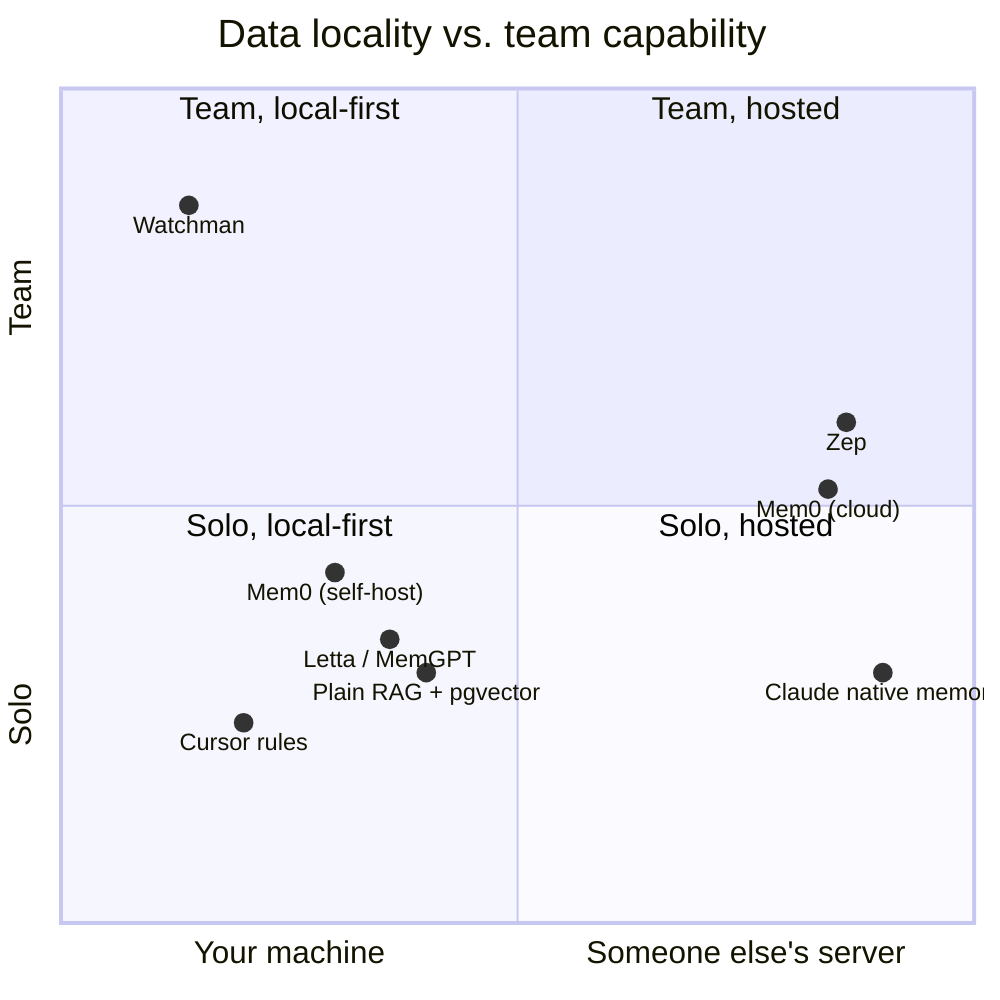
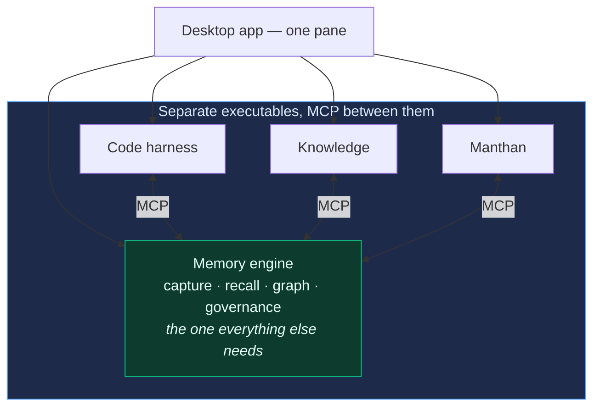
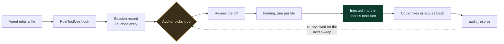
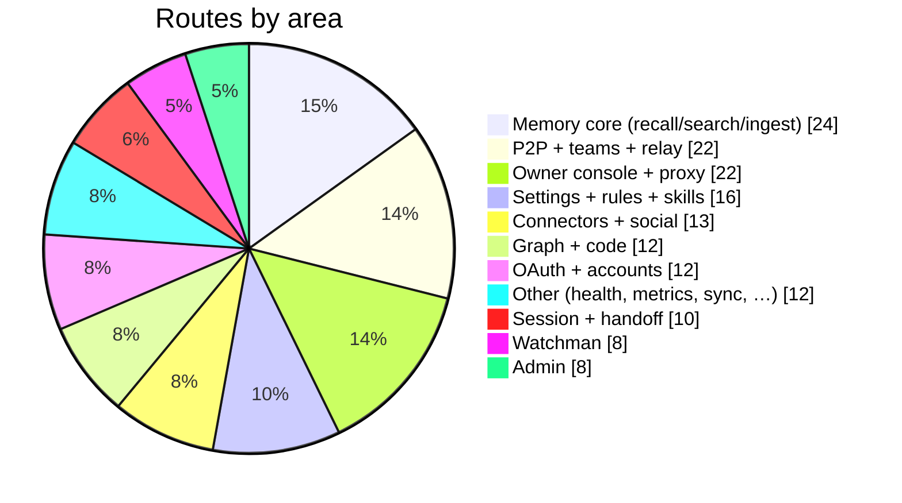
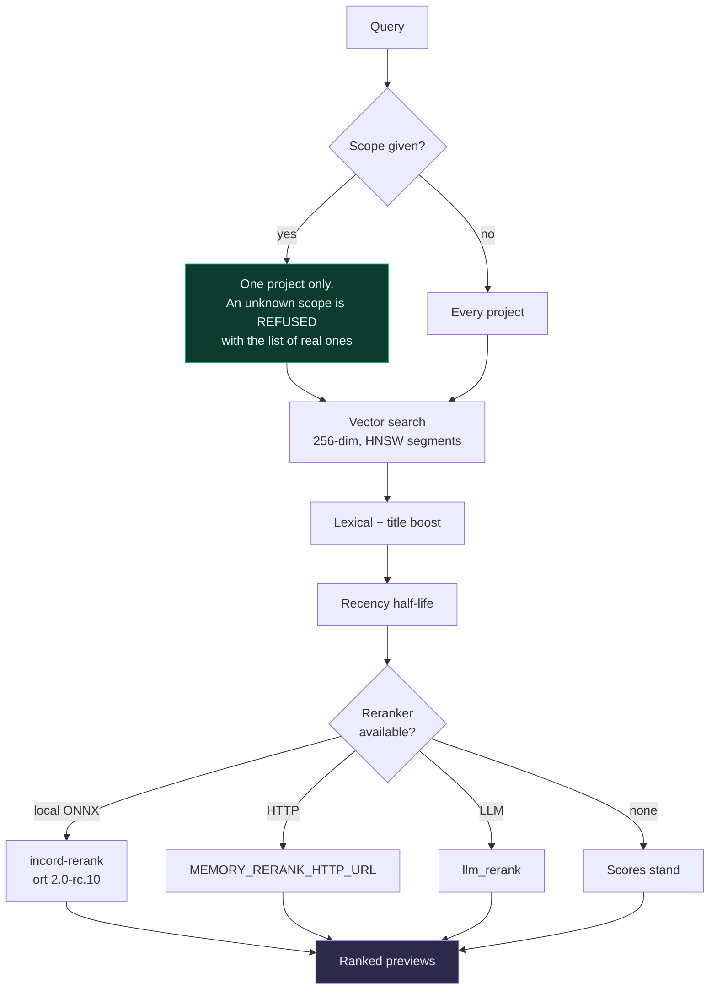
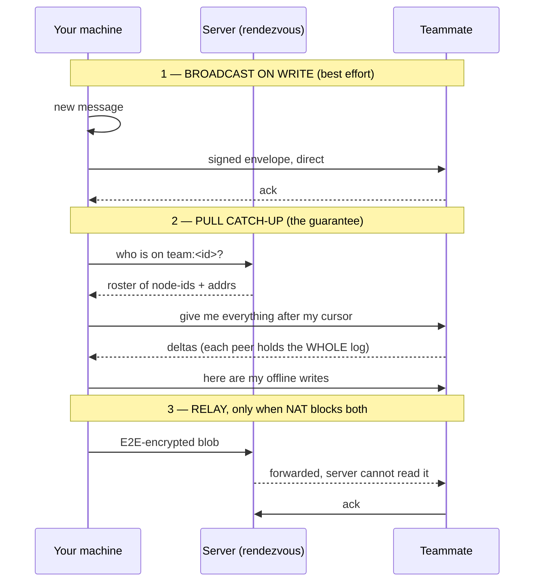
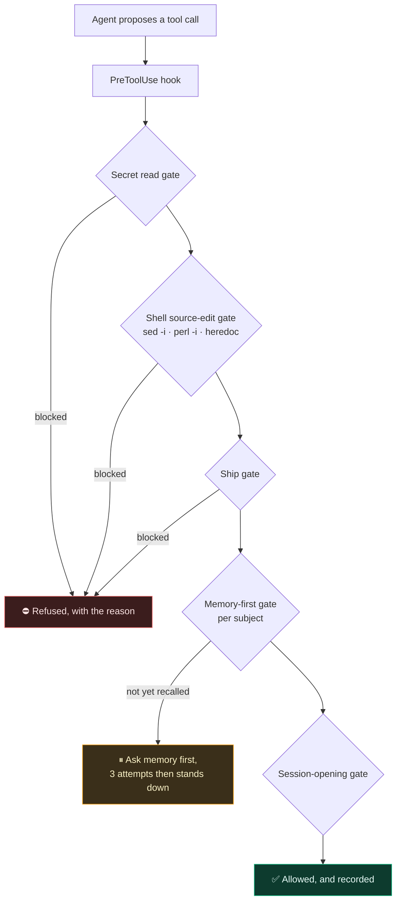
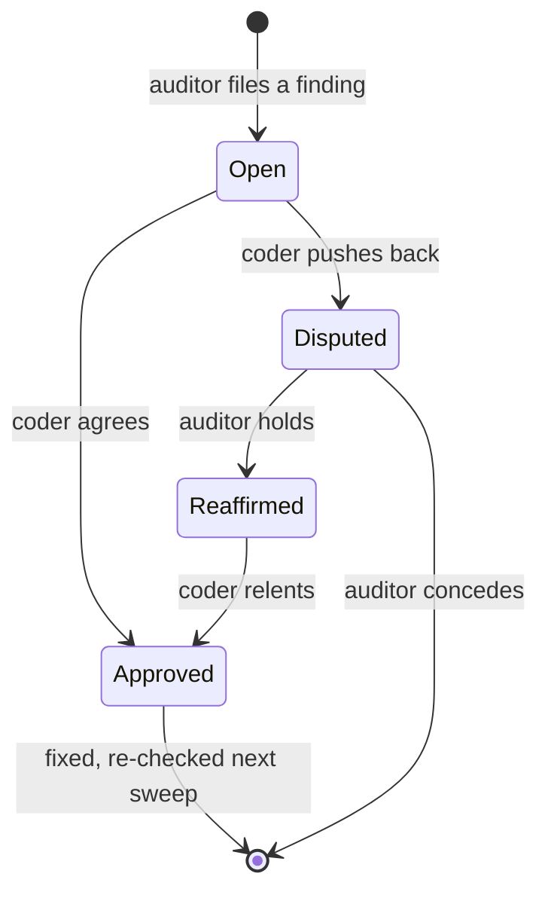
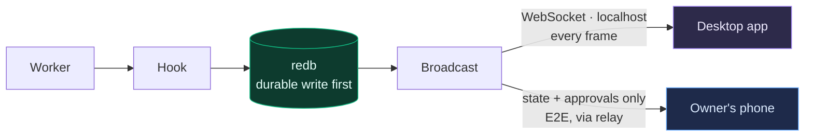

# Watchman

**Memory, governance and audit for AI coding agents. Local-first, by [Incord](https://incord.ai/).**

*This repository is the engine — `incord-memory-service`. Everything below runs inside it.*

---

**Your AI agent forgets everything when the window closes. The ones that don't are shipping your code to somebody else's server.**

Watchman is the third path: a memory, governance and audit engine that runs entirely on your machine, captures every session and every edit automatically, and syncs to your teammates **directly** — peer to peer, end-to-end encrypted, with no cloud in the data path.

It is the only system in its category that can **stop an agent mid-action**.

And it asks nothing of you after install. Hooks wire themselves. Capture starts on its own. The index, the code graph, the auditor and the sync loop all run in the background on their own schedule. There is no "remember this" step, no re-indexing, no maintenance window — **you install it and then you forget it exists**, which is precisely how memory is supposed to work.

---

<div align="center">

| 111,104 | 37 | 159 | 1,076 | £0 |
|:---:|:---:|:---:|:---:|:---:|
| lines of Rust | MCP tools | HTTP routes | tests passing | per recall |

</div>


<div align="center"><i>Everything the machine remembers, filed by project. <a href="https://incord.ai/docs/watchman/">Full product guide →</a></i></div>

---

## Four things nothing else does

Every memory product will tell you it remembers. Here is what none of them will tell you:

| | |
|---|---|
| 🔒 **It hits `Esc` for you.** | You know the move: watch an agent start down the wrong path, interrupt, type *"read the file first."* A `PreToolUse` hook does that before the call runs, on the sessions you are not watching. Guards are compiled code, not prompt text an agent can reason its way around. |
| 🔍 **The agent audits itself.** | A second model reviews the files the coder just edited and files findings the coder is forced to answer in its next turn. Claims of "fixed" are re-checked, not believed. |
| 🕸️ **It understands code, not just text.** | Symbols, call edges, file history, tree-sitter chunking. `find_symbol` returns a definition, not a ranked guess. |
| 🤝 **Teams sync machine to machine.** | The server is a phone book and a post box. It never holds plaintext, never arbitrates a conflict, and everything keeps working while it is down. |

### And nobody has to be in the loop

Most "autonomous" agent tooling means an agent that stops every four minutes to ask you a question. Watchman's default is the opposite: **it runs the whole loop without you, and interrupts only for the things that are genuinely irreversible.**

| Runs itself | What that means in practice |
|---|---|
| **Capture** | Editor hooks record every session and every edit. No "remember this" step to forget — the reason most memory tools quietly end up empty. |
| **The proxy** | Set to **decide**, it answers the coder's approval requests *as you*, from a brief you wrote about the project. You are not at the keyboard pressing yes. |
| **The auditor** | Reads what the coder actually edited, raises a finding per file, and puts it in the coder's next turn as a conversation it has to answer. |
| **The recorder** | Caches proven tool results, so the model never pays twice to work out the same answer. |
| **Session hygiene** | Facts, titles, daily summaries, clear-checks and handoffs are written on their own. Nothing to file, nothing to tidy. |

**Three things it will never decide for you**, no matter how the dial is set:

- **Anything the Guard stopped.** A guard block is never auto-decided — that is a hard rule, not a setting.
- **Anything above the severity ceiling.** You set the highest severity the proxy may act on; PIN-gated items reach you regardless.
- **Anything on an unbriefed project.** With no brief it does not guess. It stamps the card saying so, rather than leaving you to wonder why it stayed quiet.

Autonomy is a dial on the reversible work. It is never a bypass on the work that cannot be undone.

---

## Contents

- [Why local-first wins](#why-local-first-wins)
- [What it costs to run](#what-it-costs-to-run)
- [How it compares](#how-it-compares)
- [Architecture](#architecture)
- [The engine](#the-engine)
- [What agents can call](#what-agents-can-call)
- [Retrieval](#retrieval)
- [Peer-to-peer team sync](#peer-to-peer-team-sync)
- [Governance: rules, guards and gates](#governance-rules-guards-and-gates)
- [The code auditor](#the-code-auditor)
- [The owner proxy](#the-owner-proxy)
- [The recorder](#the-recorder--the-same-answer-is-never-paid-for-twice)
- [Three memory planes](#three-memory-planes-one-interface)
- [In testing — the platform](#in-testing--the-platform-built-on-the-memory)
- [Storage model](#storage-model)
- [Configuration](#configuration)
- [Engineering decisions, and why](#engineering-decisions-and-why)
- [Build and run](#build-and-run)
- [Scope, stated plainly](#scope-stated-plainly)

> **How to read this file.** Every number, path and name below was read out of this repository, and each claim names the file it came from. Where the code does not yet do something, this file says so. The competitor tables are the one exception — they are stated as of the date on the table and should be re-checked. **Paths are relative to this crate** — `src/…`, `crates/…`, `assets/…`.

---

## Why local-first wins

Ask what actually has to be true for an AI memory system to be worth adopting:

**It has to require nothing of you.** A memory tool with a "save this" button is a memory tool that ends up empty, because the moment worth saving is never the moment you think to press it. Watchman captures through editor hooks, so the record is complete whether or not anyone was paying attention. Everything downstream — indexing, the code graph, the auditor, peer sync — is background work on a schedule. The correct amount of ongoing effort is zero, and that is what this costs.

**It has to be there tomorrow.** Hosted memory is a dependency with a pricing page and a shutdown notice. The memory engine is an executable on your disk and a single redb file. There is no version of "the vendor changed direction" that takes your history away.

**It has to cost nothing at the margin.** Recall runs against a local 256-dimensional index. You are not billed to remember. That single fact changes behaviour: teams that pay per query learn to query less, and a memory nobody searches is not a memory.

**It has to be allowed near the real code.** Local-first is not a philosophical stance in a regulated shop — it is the difference between an approved tool and a rejected one. Nothing leaves the machine unless you send it to a teammate, and that goes to *them*, encrypted, not through anyone's inference API.

**It has to work at 30,000 feet, on hotel wifi, and during someone else's outage.** It does. That is not a resilience feature bolted on; there is simply no network hop in the data path to fail.

---

## What it costs to run

Agent tooling gets expensive in two ways: model calls you did not need, and your own hours spent answering prompts. Watchman is engineered against both, and the mechanisms are specific rather than aspirational.

| Mechanism | The saving |
|---|---|
| **Use the sign-in you already pay for** | The proxy, the background jobs and the auditor all run on your own installed agent CLI — your existing auth. No API key, no second bill. A metered service is available and never required. |
| **One review per decision, ever** | A decision is reviewed by a model exactly once and the flag is stored. No restart, re-notification or sync replay can spend a second call on the same card. |
| **The routine cases cost nothing** | Continuations and handoffs approve on a fast lane with **no model call at all**. Only genuinely new decisions are worth thinking about. |
| **Proven work is never repeated** | The recorder serves deterministic tool calls from the record instead of running and billing them again. |
| **The auditor has a dial** | Files per run is an explicit setting, because a strong model is slow and metered. You choose the depth instead of discovering the bill. |
| **And the largest saving is not billed at all** | Every approval the proxy answers is an interruption that never reaches you. |
| **(In testing) every subscription at once** | The Code harness runs on the plans you already hold — Claude, Gemini, Codex — and can put several on the *same* task rather than picking one at config time. |

**Set every model to `off` and it still works.** Capture, filing, linking, the graph and search all keep running with nothing spent. The memory does not depend on a model being paid — that is the floor, and the floor is free.

**And the sharing is free to start:** two teammates and one owner device, at no cost. The data path is peer to peer either way, so a free tier is not a throttled version of the product — it is the whole product, with the introduction service costing us little enough to give away.

---

## How it compares

> Competitor rows describe the shipping products as of **September 2026** — the only claims here not read from this repository. Verify before you rely on them.

| | **Watchman** | Mem0 | Zep | Letta | Claude native | Cursor rules |
|---|---|---|---|---|---|---|
| **Blocks on memory state** | **✅** per subject | ❌ | ❌ | ❌ | ❌ | ❌ |
| **Self-auditing code review** | **✅** live, on save | ❌ | ❌ | ❌ | ❌ | ❌ |
| **Decides for you while you're away** | **✅** proxy | ❌ | ❌ | ❌ | ❌ | ❌ |
| **Caches proven tool results** | **✅** recorder | ❌ | ❌ | ❌ | ❌ | ❌ |
| **Code graph (symbols · calls)** | **✅** folder-scoped | ❌ | ❌ | ❌ | ❌ | ❌ |
| **P2P team sync, no cloud data path** | **✅** | ❌ | ❌ | ❌ | ❌ | ❌ |
| Org-wide memory you can drop files into | ✅ | ⚠️ | ⚠️ | ❌ | ❌ | ❌ |
| Automatic capture (no "remember this") | ✅ hooks | ❌ | ❌ | ❌ | ⚠️ partial | ❌ |
| Runs fully offline | ✅ | ⚠️ self-host | ❌ | ⚠️ self-host | ❌ | ✅ |
| Data never leaves the machine | ✅ | ⚠️ | ❌ | ⚠️ | ❌ | ✅ |
| Works with the cloud down | ✅ | ❌ | ❌ | ⚠️ | ❌ | ✅ |
| MCP tools | ✅ 37 | ⚠️ | ⚠️ | ⚠️ | n/a | ❌ |
| Temporal knowledge graph | ✅ | ⚠️ | ✅ | ⚠️ | ❌ | ❌ |
| Multimodal embedding | ✅ img/video/doc | ❌ | ❌ | ❌ | n/a | ❌ |
| Per-project rule enforcement | ✅ | ❌ | ❌ | ❌ | ⚠️ | ⚠️ advisory |
| Desktop app | ✅ Tauri | ❌ | ❌ | ⚠️ | ✅ | ✅ |
| Marginal cost per recall | **£0** local | per call | per call | per call | per call | £0 |
| **Setup effort** | **🟢 none** — installs and self-wires | 🟢 low | 🟢 low | 🟡 medium | 🟢 none | 🟢 low |
| **Ongoing effort** | **🟢 none** — fully automatic | 🟡 manual writes | 🟡 manual writes | 🟡 manual writes | 🟡 partial | 🔴 hand-written rules |
| Ecosystem maturity | 🔴 young | 🟡 | 🟡 | 🟡 | 🟢 | 🟢 |

**Read the setup rows, then read the six bolded ones again.** The usual trade — more control in exchange for more work — is not on offer here, because there is no work. Watchman installs like the hosted options and then does six things none of them do, for nothing per call, on hardware you already own. The one honest cost is the last row: the ecosystem is young, and there are fewer people who have hit your bug before. That is the entire downside column.

### Where the data lives — the axis that decides everything else



The top-left quadrant is empty except for Watchman. Everything else forces a choice between *your data stays yours* and *your team shares a brain*. That choice is the thing this project exists to delete.

---

## Architecture


**The red box is the whole argument.** Every competitor's diagram has that box in the middle, holding the data. Here it is off to the side, holding nothing, and the system survives its absence.

### One UI, separate services

Watchman is **not one binary**. Each capability ships as its own executable, and they talk to each other over MCP — the same interface any external agent uses. The desktop app is a single pane over whichever ones you have installed.



**Install only what you use.** Plenty of people want memory and guardrails for the agent CLI they already have and nothing else — they should not download a knowledge ingestion engine to get it. One bundled download would be enormous for the majority who want one part of it.

**The memory engine is the dependency, not a hub.** It holds the store, the embedder and the graph, and the others read through it. Knowledge reuses the same embedding and reranking models rather than shipping its own — one model on disk, one set of vectors, one ranking behaviour everywhere.

> **The consequence to design for:** the model is *loaded once and served*, not loaded per process. Four executables each holding their own copy of the embedder would mean four times the RAM and four cold starts of ~2.5 minutes. One process owns the model and answers embed and rerank calls for the rest — that single decision is what makes the split cheap instead of expensive.

Because the interface between them is MCP, the boundary between services is the same one third parties get. A service you have not installed is simply a set of tools that are not there, and everything else keeps working.

### The loop that makes an agent improve instead of drift



Nothing in that loop needs you in it. That is the point.

---

## The engine

Rust, axum 0.8, tokio, redb 4.2, **111,104 lines** across `src/`, in **79 modules**.

```
incord-memory-service/
├── src/                     ← 79 modules, 111,104 lines
│   ├── api/                 ← 23 HTTP modules, 159 routes
│   ├── cli/                 ← hooks, guards, gates, install
│   ├── p2p/                 ← identity, middleware, peers, sync_loop, merge, relay
│   ├── store/               ← redb tables (findings, settings, sync)
│   ├── main.rs router.rs boot.rs wiring.rs
│   ├── mcp.rs               ← 37 MCP tools
│   ├── audit.rs             ← the code auditor
│   ├── proxy.rs proxy_prd.rs proxy_scan.rs   ← the owner proxy + belief
│   ├── search.rs score.rs scorer.rs embedder.rs vector_index.rs
│   ├── graph.rs code_chunk.rs tree.rs        ← code understanding
│   └── session_store.rs session_handoff.rs   ← capture
├── crates/
│   ├── incord-rag/          ← embed + rerank, multimodal entry points
│   ├── incord-rerank/       ← ONNX reranker (ort 2.0-rc.10)
│   └── incord-simd/
├── assets/owner/            ← owner.html, include_str!'d into the binary
├── docs/  deploy/  Cargo.toml  README.md
```

### Module map

| Area | Modules |
|---|---|
| **Capture** | `auto_capture`, `hooks`, `session_store`, `session_handoff`, `file_memory`, `extract` |
| **Retrieval** | `search`, `score`, `scorer`, `rerank_ext`, `llm_rerank`, `vector_index`, `embedder`, `think` |
| **Code understanding** | `code_chunk`, `code_sweep`, `graph`, `tree`, `data_chunk`, `file_history` |
| **Governance** | `cli/guard_rules`, `cli/guard_match`, `cli/guard_state`, `cli/ship_gate`, `cli/pre_tool_decide`, `redact` |
| **Audit** | `audit`, `store/findings_store` |
| **Proxy** | `proxy`, `proxy_prd`, `proxy_scan`, `owner_web`, `owner_sync`, `idle_watch` |
| **Sync / P2P** | `sync`, `sync_health`, `p2p/*` (identity, middleware, peers, broadcast, sync_loop, merge, peer_cache) |
| **Identity** | `auth`, `tenant_auth`, `oauth`, `oauth_api`, `space`, `projects`, `scope_backfill` |
| **Integration** | `mcp`, `connectors`, `integrations`, `social`, `tavily`, `discover`, `antigravity` |
| **Ops** | `jobs`, `worker_beat`, `task_cost`, `boot`, `wiring`, `router`, `store_migrate`, `rate_limit` |
| **Knowledge** | `facts`, `project_facts`, `skills`, `watchman`, `watchman_capture`, `watchman_api` |

### Feature flags — `Cargo.toml`

| Flag | Default | What it does |
|---|---|---|
| `owner_console` | ✅ on | Owner approval PWA, proxy, SSE |
| `owner_push` | ❌ off | VAPID Web Push. Pulls a C dependency (OpenSSL via `hyper-tls`), which is why it is separate. |
| `gpu` | ❌ off | GPU embedder. Costs ~75 s at model load to compile sequence-bucket kernels. |

> ⚠️ **`--features owner_push` is mandatory for any real deployment.** A plain `cargo build --release` compiles Web Push *out*, silently. The desktop sidecar builds with `owner_push,gpu` (`gpu-metal` on macOS).

---

## What agents can call

### MCP — 37 tools

From `src/mcp.rs`. This is the surface an agent actually lives on.

| Group | Tools |
|---|---|
| **Recall** (5) | `recall`, `recall_index`, `recall_get`, `recall_timeline`, `memory_search` |
| **Write** (3) | `remember`, `ingest_code`, `ingest_message` |
| **Correct** (3) | `edit_memory`, `forget_memory`, `forget_node` |
| **Reason** (1) | `think` — a synthesised, cited answer plus an explicit list of what is still unknown |
| **Code graph** (6) | `find_symbol`, `find_trajectory`, `file_history`, `trace_path`, `detect_changes`, `scope_index` |
| **User graph** (6) | `user_graph_search`, `user_graph_get_node`, `user_graph_put_node`, `user_graph_list_nodes`, `user_graph_path`, `user_graph_communities` |
| **Audit** (4) | `audit_findings`, `audit_get`, `audit_set`, `audit_resolve` |
| **Watchman** (3) | `watchman_lookup`, `watchman_handoff`, `watchman_report` |
| **Owner** (3) | `owner_ask`, `owner_post`, `owner_wait` |
| **Settings** (2) | `settings_get`, `settings_set` |
| **Meta** (1) | `incord` |

**Two-stage recall is the one to understand.** `recall_index` returns ranked *previews*; `recall_get` fetches only the ones worth reading. Every other memory tool makes you pay context for the whole result set, so agents learn to search narrowly and miss things. Here a wide search is cheap, which means the agent can afford to actually look.

`think` deserves a note too: it returns what memory knows **and an explicit list of what it does not**. An answer that admits its own gaps is the difference between a memory system and a confident fabricator.

### HTTP API — 159 routes



<details>
<summary><b>Full route list by area</b></summary>

**Memory core**
`/v1/memory/search` · `/recall/index` · `/recall/get` · `/recall/timeline` · `/remember` · `/messages` · `/messages/batch` · `/ingest_message` · `/ingest_code` · `/ingest-projects` · `/conversations` · `/conversations/{id}` · `/conversations/{id}/messages` · `/embeddings` · `/think` · `/chat` · `/trajectory` · `/orient` · `/discover` · `/scopes` · `/restamp` · `/metrics` · `/usage` · `/health`

**Sessions and handoff**
`/session` · `/sessions` · `/session/entry` · `/session/entry/resolve` · `/session/catchup` · `/session/clear-check` · `/session/clear-request` · `/session/clear-confirm` · `/handoff` · `/files/conversations`

**Code and graph**
`/code/chunks` · `/code/sync` · `/graph/query` · `/graph/nodes` · `/graph/relate` · `/graph/path` · `/graph/export` · `/graph/communities` · `/graph/find-symbol` · `/graph/file-history` · `/project/facts/verified` · `/admin/code-sweep`

**Audit**
`/audit/findings` · `/audit/findings/{id}/apply` · `/audit/findings/{id}/dismiss` · `/audit/findings/clear`

**Owner console and proxy**
`/v1/owner/pending` · `/decide` · `/enqueue` · `/feed` · `/post` · `/comment` · `/history` · `/status` · `/meta` · `/key` · `/team` · `/peers` · `/channel` · `/clear` · `/proxy` · `/stream` · `/subscribe` · `/push/clear` · `/wait` · `/ask-memory` · `/owner.html` · `/owner-sw.js`

**P2P and teams**
`/p2p/bind` · `/p2p/unbind` · `/p2p/bindings` · `/p2p/bindings/{team}/key` · `/p2p/bindings/{team}/relay-key` · `/p2p/bindings/{team}/grants` · `/p2p/bindings/{team}/rotate` · `/p2p/browse` · `/p2p/teams/{team}/peers` · `/p2p/teams/{team}/versions` · `/p2p/teams/{team}/candidates` · `/p2p/teams/{team}/merges` · `/p2p/teams/{team}/merge/propose` · `/p2p/teams/{team}/merge/approve` · `/v1/teams/{id}/rendezvous` · `/rendezvous/announce` · `/relay/send` · `/relay/inbox` · `/relay/ack`

**Settings, rules, skills**
`/settings/audit` · `/settings/embed` · `/settings/handoff` · `/settings/jobs` · `/settings/llm` · `/settings/projects` · `/rules` · `/rules/for` · `/rules/manage` · `/skills` · `/skills/toggle` · `/enforcement` · `/agents` · `/agent-dirs` · `/companies` · `/companies/list`

**Watchman**
`/watchman/lookup` · `/watchman/handoff` · `/watchman/report` · `/watchman/recent` · `/watchman/tasks` · `/watchman/record/{id}` · `/watchman/for-memory/{msg_id}`

**Connectors, social, integrations**
`/connectors` · `/connectors/list` · `/connectors/{id}/test` · `/{id}/sync` · `/{id}/query` · `/{id}/delete` · `/social/providers` · `/social/{slug}/begin` · `/{slug}/callback` · `/{slug}/sync` · `/tavily/search` · `/drives` · `/llm/models`

**OAuth and accounts**
`/.well-known/oauth-authorization-server` · `/.well-known/oauth-protected-resource` · `/oauth/register` · `/oauth/authorize` · `/oauth/authorize/approve` · `/oauth/token` · `/link-account` · `/unlink-account` · `/secure`

**Admin**
`/admin/keys` · `/admin/keys/reset` · `/admin/keys/revoke` · `/admin/clear-titles` · `/admin/purge-analysis` · `/admin/refile-projects` · `/admin/refile-report` · `/admin/rewire-graph`

**Streaming**
`/v1/memory/stream` · `/notifications` · `/notifications/sse` · `/notifications/seen` · `/mcp` · `/mcp/sse` · `/tools` · `/tools/{name}`

**Sync**
`/sync` · `/sync/push` · `/sync/run` · `/sync-status`

</details>

### CLI — 50 commands

From the top-level command enum in `src/cli.rs`. (Extracted by pattern; a handful are sub-enum variants rather than top-level commands, so treat 50 as the upper bound.)

| Group | Commands |
|---|---|
| **Serve** | `serve`, `status`, `doctor`, `test`, `eval` |
| **Setup** | `install`, `install-hooks`, `setup`, `config`, `connect`, `login`, `link`, `unlink` |
| **Memory** | `remember`, `recall`, `search`, `think`, `forget`, `get`, `list`, `ingest-code`, `restamp`, `trajectory` |
| **Hooks** | `hook`, `capture`, `pre-tool`, `pre-compact`, `session-start`, `session-end`, `user-prompt`, `code-edit` |
| **Audit** | `audit`, `findings`, `sweep` |
| **Guards** | `guard`, `mode`, `ok` |
| **Owner** | `owner`, `ask`, `post`, `wait`, `proxy`, `clear` |
| **Projects** | `add`, `remove`, `add-folder`, `remove-folder`, `set`, `show` |
| **Sync** | `sync` |

### Editor hooks — 7 events

This is why the memory is never empty.

| Event | What Watchman does |
|---|---|
| `SessionStart` | Injects rules, project memory, open audit findings, the session record |
| `UserPromptSubmit` | Injects the relevant memory for *this* prompt |
| `PreToolUse` | **Can block the call.** Guards, gates, rule enforcement |
| `PostToolUse` | Records the edit as a `Touched` entry — the only category a hook may write |
| `PreCompact` | Seals the session record before the window is summarised |
| `SessionEnd` | Writes the handoff |
| `Stop` | Captures the turn |

> `PostToolUse` writing only `Touched` is deliberate. Every other entry category is a *claim about meaning* — what is outstanding, what remains true — and only the agent doing the work can make one. A file edit is a mechanical fact the hook already observes, so it costs no model call and cannot be wrong about itself.

---

## Retrieval



**Scope is a boundary, not a preference.** A scoped search never widens into a global one — so a scoped answer can never quietly contain the client's code you are not supposed to be looking at. An unknown scope is refused *with the list of known ones*, because silently returning nothing is how a search engine teaches you to distrust it.

**Embeddings are 256-dimensional**, truncated from the model's native width and re-normalised to unit length before storage (`src/embedder.rs:526`). The `incord-rag` crate also carries multimodal entry points — `embed_image`, `embed_video`, `embed_document`, `has_vision` — alongside `rerank`, `rerank_with_instruct` and `rerank_batch`.

### One embedding space, everywhere

**Qwen embeds at rest on every machine, GPU or not.** Vectors written on a workstation and vectors written on a laptop are directly comparable — which is what makes P2P sync of code chunks possible at all. A store whose vectors depended on the hardware that wrote them could not be merged across machines, and the failure would not even be an error: just silently wrong neighbours.

Only the **reranker** adapts to the hardware. `MEMORY_RERANKER` takes `auto`, `quality` or `fast` — the large cross-encoder when an accelerator is usable, the small one (MiniLM) otherwise. The choice is made at engine start, because it decides which weights are read off disk.

That split is deliberate. Reranking reorders candidates and **never writes state**, so falling back costs a little ranking quality and nothing else. Embedding writes the index, so it does not get to vary.

> A team that needs identical ordering across machines pins `MEMORY_RERANKER` rather than leaving it on `auto` — otherwise a GPU machine and a CPU machine will order the same candidate set slightly differently.

### The graph is folder-shaped, not one giant blob

This is where most knowledge-graph memory quietly falls over. Everything gets wired to everything, the graph becomes a hairball, and by month three a query traverses half your history to answer a question about one file.

Watchman does not build that graph. **Nodes are organised by folder, under a project id, and the traversal radius stays small.** A question about `src/p2p/` walks `src/p2p/` — not the other eleven projects, not last year, not the company handbook. The structure your code already has *is* the structure of the graph, which means it stays legible at a million nodes for the same reason a filesystem does.

Two things fall out of that, and both matter more than they sound:

- **Answers stay relevant as the graph grows.** Precision does not decay with volume, because volume elsewhere is not in the search path.
- **A scoped answer cannot leak.** Combined with scope refusal above, another project's code has no edge that reaches this query.

---

## Peer-to-peer team sync

A team is a pseudo-user `team:<id>` holding an **append-only log**. `/v1/memory/sync` (GET) and `/sync/push` are idempotent on `client_msg_id`, so re-sends and overlapping windows converge.



Broadcast is best-effort; pull is the guarantee. **Cursor plus idempotency means nothing is ever missed, no matter how long a node was offline.** Come back after two weeks on a boat and you are current.

### What travels which way

| Payload | Path | Source |
|---|---|---|
| Team **code chunks** | Direct peer pull only (`sync_loop.rs` step 2, `pull_one`) | `code_share::publish` writes to the local team log; teammates pull |
| Owner-console decisions | Relay inbox / broadcast | `owner_sync.rs` |
| Merge proposals | Relay inbox / broadcast | `merge.rs` |

Code chunks are **content-addressed and deduplicated** — in a verified test, one chunk of a file was edited on a Mac and only that chunk moved to the PC; the file's other 11 chunks stayed put.

### The server's role, precisely


*Which machines are reachable directly, and which are being relayed.*

| Does | Does not |
|---|---|
| Directory — nodes register an address, look up their team roster | Hold plaintext |
| Membership gate — vouches which node-ids are on a team | Arbitrate conflicts |
| NAT relay — forwards E2E-encrypted blobs | Read what it forwards |

Identity is an **ed25519 keypair as node-id** (`src/p2p/identity.rs`), with signed-HTTP envelope verification, ±30 s freshness and a replay guard (`src/p2p/middleware.rs`).

> **Design history worth keeping.** The P2P layer was adapted from `brain`'s `incord-network` crate, deliberately trimmed. Dropped: the routing HashRing, fetcher/consumer, witness, quorum, directive/governance, `chain.rs` and payouts. Blockchain, staking, witness and quorum were **explicitly rejected** for memory — they belonged to `brain`, not here. Gossip was not copied either: `brain` uses static seed peers, memory uses server rendezvous.

---

## Governance: rules, guards and gates

**You already know this move.** You are watching an agent work, you see it start down the wrong path, you hit `Esc` and type *"read the file first."*

That keystroke is the most valuable thing you do all day, and it has two problems. It is **late** — the agent has already started. And it needs **you sitting there**, which means it does not happen at 2am, or on the fourth parallel session, or on the run you walked away from.

This is that keystroke, fired before the call executes, on the sessions nobody is watching.

Every other tool in the comparison table implements rules as text in a prompt, which means the rule holds exactly as long as the model feels like honouring it. Here a rule is a function that returns *refused*.



| Gate | File | What it stops |
|---|---|---|
| `secret_read_gate` | `src/cli/guard_match.rs` | Reading credential files |
| `shell_source_edit_gate` | `src/cli/guard_match.rs` | In-place source rewrites through the shell (`sed -i`, `perl -i`, heredocs) where no gate can see them |
| Ship gate | `src/cli/ship_gate.rs` | Publishing without the checks |
| Memory-first gate | `src/cli/guard_rules.rs` | Acting on a subject before querying memory about it |
| Session-opening gate | `src/cli/guard_rules.rs` | Starting work without reading the previous session's handoff |

The shell source-edit gate is the one people underestimate. An agent that cannot edit a file through the editor tool will reach for `sed -i` — and every governance layer built on tool names is now blind. Watchman blocks that path specifically.

### The command classes, and the two postures above them


*Destructive git · commits · pushes · file deletes · database writes · deploys · remote transfers · SSH mutations · sudo.*

Each class flips between **strict** and allow-always **independently**, so tightening one does not quietly loosen another. Two switches sit above them:

- **Autopilot** — routine, checked-safe calls run without asking. Risky decisions still go to your phone, and hard blocks still block.
- **Approve everything here** — the opposite posture. Every non-trivial call, including file edits, waits for you or the proxy. It is a file in the project (`.incord/FORWARD_ALL`), so it travels with the repo instead of living in a menu.

There is a CLI too — `guard allow / block / once / status` — for when you are already in a terminal.

### What a block actually looks like

Not a warning in a log. The tool call does not run, and the agent is handed the reason and the way out:

```
Error: PreToolUse:Bash hook error:
["C:\Users\...\AppData\Local\Incord Memory\incord-memory-service.exe"]
hook pre-tool:

⛔ Rule 9 (memory first) — action-time gate, subject "vps", attempt 1 of 3.
This session has not queried memory about THIS subject. Incord already
holds the past decisions, the deploy path and the architecture for this
machine; deriving them again from the filesystem is how the same ground
gets re-covered every session.

  • Ask about this subject — `recall_index` with a plain-language question
    mentioning "vps", then `recall_get` for the hits you need. Then repeat
    this call: it clears "vps" for the rest of the session.
  • A recall about something ELSE does not clear this one. The gate is per
    subject because one recall used to clear every subject for a whole session.
  • Memory is context, not ground truth for code (Rule 9) — re-verify
    anything code-related against the current source before acting on it.

After 3 attempts this subject stands down on its own, so a memory service
that is down cannot wedge the session.
```

And the next line in that transcript is the agent complying — `recall_index` with `query: "VPS production deploy — disk and data volume for the redb databases"`, returning reranked hits from its own history.


Four things in that message are the design, not the wording:

| | |
|---|---|
| **The gate is per subject** | One recall used to clear every subject for a whole session. It doesn't any more — asking about something else does not buy you this one. |
| **It teaches the way out** | The block names the exact tools to call and what will clear it. A guard that only says *no* gets disabled by the end of the week. |
| **It stands down after 3** | A memory service that is down cannot wedge a session. Refusing to fail open here would make the whole thing unshippable. |
| **Memory is context, not ground truth** | The rule tells the agent to re-verify anything code-related against current source. Memory that claims to be authoritative about code is worse than no memory. |

**This is the part that has no equivalent elsewhere.** Blocking a tool call is not itself rare — several agent runtimes can deny one. What is rare is a block *conditioned on memory state*: this call is stopped because the store knows this session has never asked about `vps`, and it unblocks the moment that stops being true. No other tool can gate on that, because no other tool holds the state to gate on.

### Why this holds where a prompt does not

The rule is not text in a system prompt asking the model to behave. It arrives **at process time, as the tool call's result**. That difference is the whole reason the mechanism works, and it is worth being precise about what each layer actually guarantees:

| Layer | Guarantee |
|---|---|
| **The call does not run** | Deterministic. The hook returns a block and the tool never executes. There is no model judgement involved, so there is no percentage attached to it. |
| **The obvious routes around it are closed** | Deterministic, per covered route. This is what `shell_source_edit_gate` is for — an agent denied the editor tool reaches for `sed -i`, and that path is gated too. |
| **The agent then does the right thing** | Probabilistic, and high — a reason delivered as a tool result is acted on far more reliably than the same sentence sitting in a prompt from 200 messages ago. But it is the model deciding, so it is not a guarantee. |
| **The irreversible still reaches you** | Deterministic. Guard-stopped commands are never auto-decided, and the severity ceiling and PIN gate hold regardless of the proxy's posture. |

**Read that table as defence in depth, not as one claim.** The layer that stops damage is the first one and it does not depend on the model cooperating. The layer that depends on cooperation is the one that decides whether the session continues *gracefully* — and if it fails, the cost is a wasted attempt, not a deleted database. The blast radius of the probabilistic layer is bounded by the deterministic ones on either side of it.

### It remembers what it got wrong

Mistakes are stored as facts like anything else, and injected the same way. An agent that broke a build a particular way, or took a wrong approach on a subject, meets that record the next time the subject comes up — not as a rule someone wrote afterwards, but as its own history.

This is the compounding half of the design. Rules cover what you thought to forbid in advance. **The stored-mistake record covers what nobody predicted**, which is most of it, and it grows without anyone maintaining it.

### What has no switch at all


The genuinely destructive cases are **not on that page**, and their absence is the design: deleting a critical path, reading secret files, piping the web into a shell. There is no toggle to find because they are never bypassable. A permission system whose most dangerous entries can be turned off by the thing being governed is decoration.

### The approval finds you


*Named rule, exact reason — you decide on the specific act, not on "an agent wants something".*

A desktop notification here, a push on your phone, a card in the console. Each names the rule that stopped it and why.

### Staleness gates — where model knowledge is systematically wrong 🚧

A model suggests whatever was common in its training data, not what exists today. It reaches for the version it saw most often, and it has no way to know which things have moved since. That is not an occasional mistake — it is a **predictable, structural** failure with a known trigger moment.

Which makes it gateable. The first one fires when a dependency is added: the call is held until the current version has actually been checked against the registry.

| Trigger | What the model gets wrong |
|---|---|
| **Adding a dependency** | The version it remembers, not the version that shipped |
| **Calling a changed API** | A signature that was correct at cutoff |
| **Using a deprecated flag** | A flag that has since been removed |
| **Writing a config** | A format that has since changed shape |

The interception point is what makes these possible at all. Catching a stale version at review time means it is already in the tree; catching it at the moment of use means it never enters. **Nothing that reads the diff afterwards can do this** — you have to be standing at the tool call.

Three properties carry over from the gates above, and all three are required:

- **Cached per subject.** A package checked once this session is not checked again — otherwise fifteen additions to a `Cargo.toml` become fifteen round trips, and a gate that slow gets switched off by the end of the week.
- **Recorder-backed, with a time bound.** A registry lookup is close to deterministic within a short window, so it belongs in the recorder — but on a TTL rather than a permanent verdict, since the answer changing is the entire point.
- **Stands down when offline.** Unreachable registry means the gate steps aside on the same three-attempt rule. A flaky network must never wedge a session.

### Beyond code — guards per category 🚧

The gates above were built for a coder, and code is the **reversible** case: a bad edit is a `git revert`. The categories coming next are the ones where that is not true. A sent email has no undo. A published post is screenshotted before it is deleted. A PR comment is already in someone's inbox.

So the guard extends from the domain where mistakes are cheap into the domain where they are permanent — and rules become **per folder and per category**: the folder says which project, the category says how bad a mistake would be.

| Category | Examples |
|---|---|
| **Outbound communication** | Email, chat replies, PR and issue comments, social posts |
| **Spend** | Anything that costs money |
| **Identity** | Anything published *as* you or as the company |
| **Data destruction** | Deletes, drops, force-pushes |

#### The default has to invert

Every code gate stands down after 3 attempts, because a memory service that is down must never wedge a session. **Carrying that rule into outbound actions would be a bug**, not a feature: block, block, block, *send anyway* turns the guard into a three-attempt delay on precisely the thing it exists to stop.

| | On failure, or no answer |
|---|---|
| **Code gates** | **Fail open.** Worst case is ground re-covered. Wedging the session is the larger harm. |
| **Outbound, spend, identity, destruction** | **Fail closed.** Nothing goes without an answer. An unsent email is an inconvenience; a sent one is permanent. |

"No answer" includes you being asleep. These wait, rather than timing out into a send.

**And the approval has a cryptographic identity, not a role.** What waits on your phone is the actual text that would go out, sealed to your owner key — so a teammate cannot approve it on your behalf, and the relay carrying it cannot read it. That is a stronger guarantee than a human-in-the-loop checkbox, because the human in the loop is provably you.

**Every code gate stands down after 3 attempts**, and each has an off switch (`MEMORY_FIRST_OFF`, `SESSION_OPENING_OFF` in a project's `.incord/`, or `~/.incord/RULE_GATE_OFF` globally). **A memory service that is down can never wedge a session** — a deliberate property, not an accident. Enforcement you cannot disable is enforcement you will eventually rip out.

Rule text is injected at `SessionStart` and again on `UserPromptSubmit`, so a rule cannot fall out of a long context.

---

## The code auditor

Memory captures what happened. **The auditor goes looking for what is wrong.**

The moment the coder saves a file, the `PostToolUse` hook writes a `Touched` entry (`src/cli/capture_session.rs:217`) and that file becomes a candidate. The sweep picks it up on the cadence you set — hourly through end-of-day — raises a finding, and puts it in the coder's next turn as a conversation it has to answer. Not a one-line complaint: a finding can be discussed, corrected, or closed with a reason.

**It reviews what was edited, not what the folder contains.** Selection reads those `Touched` entries, so the edit list costs no model call and no directory walk. A file that arrives any other way — a pull, a merge, another tool — is deliberately *not* a candidate. This is an audit of the coder's work, not a repository scanner.


*Files per run is the cost dial. The build command is the safety catch.*

### The build command is not optional

The **build/test command** gates every fix the auditor applies. A fix that fails it is **reverted** and left for a human, and auto-apply cannot even be switched on until you have set one. The auditor is structurally incapable of leaving behind code it has not proven still builds — which is the difference between a review bot you can leave running and one you have to babysit.

Findings feed the same memory as everything else, so the proxy reviewing a decision about a file can see what the auditor already said about it.



**One finding per file, not per line.** The finding's identity is the file (`Finding::make_id(path, "")`); the worst severity wins and every issue in that file becomes a round of the same conversation. The earlier per-line identity produced 6,179 findings across 141 files on one install — 37 MB, and 20.1 s to list the open ones. Per-file is not a simplification; it is what makes the feature usable at all.

A claim of "fixed" is **not trusted**: the auditor re-reviews any file whose mtime is newer than the finding, so a fix that did not hold comes straight back.

---

## The owner proxy

**The half of the product that acts.** Memory answers questions you thought to ask. The proxy uses the same memory to answer the approvals your agents raise while you are asleep — and every answer you give it becomes evidence for the next case, so it gets better at being you the more it is used.


*Off, recommend or decide — plus the severity ceiling and the per-project brief it decides from.*

### Three postures

| | |
|---|---|
| **Off** | Never calls a model at all. |
| **Recommend** | Reviews and advises. You still decide. |
| **Decide** | Answers as you, and escalates the rest. |

Alongside the posture sits a **severity ceiling** — the highest severity it may act on. PIN-gated items always reach you regardless. And two hard limits no setting can move: **commands stopped by the Guard are never auto-decided**, and a project with no brief is never decided on at all — the card is stamped saying so rather than left silently pending.

### The brief it decides from

A brief is short. *"Ship fast, never break prod, no new dependencies"* is a complete answer. It has three parts, and **each saves on its own** — answer `about` today and `goals` next week; an empty field never overwrites a stored one.

| Part | What it is |
|---|---|
| `about` | What the project is, and what it is *not* |
| `goals` | What success looks like, what comes next, what must never be approved |
| `prd` | The product document every decision is judged against |

The product document grows beside it, drafted *with* you: the proxy researches, checks its claims, files the result into the project's memory, and comes back with the questions it could not answer from the code — which market ships first, which stack is the truth going forward, what licence you intend. **Intent is not in your source files, so it asks rather than inventing.**


*It argues back when the facts do, and every claim carries its source.*

### The approvals still reach you — wherever you are


*A blocked agent is not blocked until you are back at your desk.*

The owner's app pairs to your account with an **owner key** and carries what is waiting: `INBOX`, `CHAT`, `DECIDED`, `PRODUCT`. It is the same memory, not a summary of it — ask what changed, what was decided, or why something is the way it is, and the answer is grounded in your own history.

A device paired with an owner key can answer your approvals; a crew invitation cannot. The guard's cards and the proxy's notes are **sealed to that key** and travel only to your own devices — a teammate is never sent them, and the relay that carries them between machines cannot read them.

### Under the hood: documents are read once

Each scanned file carries a stable `id` (SHA-256 of its project-relative path) and a `stamp` (a digest of the text actually read), kept in `ProjectBrief.doc_reads`. A document whose stamp matches is **named but not re-sent** — the drafter is told it is part of the belief already held, so its absence can never be read as the project lacking it.

> The stamp is a content digest rather than size+mtime. Size+mtime was tried first and was measurably wrong on this hardware: two fixture files written in one operation came back with byte-identical stamps, because the filesystem's mtime granularity is coarser than the writes. The scan has already read the file, so hashing costs no extra IO — and what this saves is tokens, not the local read.

The rate limit on the questions that *do* reach you is a single rule with no timer: **an unanswered question stops the asking, and an answer restarts it.** Silence is self-terminating in both directions — no notification storm, no queue that ages out something important.

---

## The recorder — the same answer is never paid for twice

A model that solves an identical problem on Tuesday and again on Wednesday has billed you twice for one piece of thinking. The Watchman recorder ends that.


*Deterministic calls are marked **serve, don't run**. Divergent ones are **never cached**.*

Every tool call is recorded with its exact input and output, and each `(tool, input)` signature earns one of three verdicts:

| Verdict | What happens |
|---|---|
| **Deterministic** | Same answer every observed run. **Serve, don't run** — the stored output is returned and no model call is made. |
| **Divergent** | The answer changes. **Never cached** — an answer that varies must be asked again. |
| **Unwitnessed** | Seen once, not yet proven either way. Most calls start here and only earn a verdict after enough observations to be sure. |

That last row is what separates this from a prompt cache. A cache assumes a result is still good because a timer has not run out. The recorder **proves** it by repeated observation, and refuses to cache anything it has watched change.

| Tool | What it gives you |
|---|---|
| `watchman_lookup` | Ask before running: is this exact call already solved? On a hit, serve the output and skip the tool entirely. |
| `watchman_handoff` | **Already solved** — the exact calls that no longer cost anything, each with how many times it has been reused instead of re-run. |
| `watchman_report` | The determinism census: how much of a project's behaviour is deterministic, how much diverges, and which models produced it. |

The compounding effect is the point. A project's routine work migrates, call by call, out of the expensive model and into a lookup table — and the handoff list tells you exactly how much has already moved.

---

## Three memory planes, one interface

Memory is not only your own history. Watchman keeps three planes and exposes each over MCP, so any agent — coding, social, internal — reads the one it needs and nothing else.

| Plane | Who fills it | What it is for |
|---|---|---|
| **Personal / project** | Editor hooks, automatically | Your sessions, edits, decisions, code graph, filed per project |
| **Company** | Anyone in the org, via databases and connectors | Business data — documentation, rows, records — landing in a company's own folder and searchable with everything else |
| **Connected accounts** | Social and connector sync | Social-agent memory and third-party sources, addressable through the same tools |


*A company is a name plus a real folder on a drive you pick.*

**Company data sits beside your work, not mixed into it.** The ordering is deliberate: a company must exist before a database can be attached, because otherwise there is nowhere for the rows to go. Once attached, what the connector returns is filed to that company's folder, embedded, linked into the graph, and findable exactly like everything else — with no separation to maintain and no ETL job to own.

### Filed by folder, not piled in a heap

This is the rule underneath all three planes, and it is why they stay separable:

> **Memory is filed by folder.** You name projects and assign folders to them; anything captured under an assigned folder belongs to that project. **The deepest matching folder wins**, so a subproject beats its parent, and anything unassigned lands in `general`.


*One name that memory, decisions and the proxy all use to mean the same thing.*

Because each plane is a separate MCP surface, **anyone can build on it**. Your memory is exposed as an MCP connector over OAuth — paste the URL into another AI app's connector settings and approve on the consent screen. There is no key to copy. An agent that has no business reading your code can still read the company handbook; the boundary is the interface, not a promise.

---

## In testing — the platform built on the memory

> **Everything above this line ships today.** Everything below runs in the beta app (`v0.1.0`) and is **not finished**. It is documented here because the shape matters: memory is the foundation, and these are what a foundation that already remembers makes possible. Do not plan around dates.
>
> Each of these is a **separate executable** that reaches the memory engine over MCP. Install the ones you want; the rest are simply absent.

### Code — a harness that finishes the job


*Builder · Reviewer · Tester · Deployer · Migrator — each with its own state, and the local address of whatever is serving.*

Built because the existing agent CLIs stop. This one runs a crew of workers to the goal, spawns sub-agents on its own, records every file it touches, and reports where the running thing is listening so you can open it.

The commercial point is the model routing: **it runs on the subscriptions you already pay for.** Claude, Gemini and Codex can work the *same task at the same time* — not one provider chosen at config time, but several in parallel on one goal. Combined with the recorder, the routine half of the work stops reaching a metered model at all.

### Live session view — watch it work, and steer it

The Code page files edits when a turn ends. That is right for memory and wrong for watching, so the live view is a second path: **full fidelity on localhost, a digest to your phone.**



**The socket is never the source of truth.** The durable write happens first and the stream is a projection of it. Each session frame carries a monotonic sequence number, so a client that reconnects says *"I have up to N"* and the gap is replayed from the store — the same cursor-and-idempotency guarantee the P2P pull already gives. A closed laptop lid loses nothing.

**The full stream costs the server nothing**, because it never reaches the server. The engine is already on the machine and so is the app: that WebSocket is localhost, with no TLS, no bandwidth and no relay hop. It scales with your hardware, not ours.

Only the owner's phone goes through the relay, and it does not get tokens — it gets **state transitions and approvals**, tens of frames per session rather than thousands. Since the relay carries E2E-encrypted blobs it cannot read, the ciphertext cannot be compressed or coalesced; sending a digest rather than a stream is the only optimisation available, so that is what it sends.

#### What is on the timeline is the point

Live output is table stakes — every harness shows activity. What no other one can put on that timeline is the governance:

| Frame | What you see |
|---|---|
| **Blocked** | Which guard rule fired, and the exact reason |
| **Decided** | That the proxy answered as you, and which line of the brief it decided from |
| **Served** | A recorder cache hit — no model call — with a running count of calls saved this session |
| **Finding** | The auditor's finding landing against a file seconds after the coder wrote it |

That is not an activity log. It is a live record of an agent being governed, and it is the one part of a coding harness a competitor cannot copy without first building a guard, a proxy, a recorder and an auditor.

> Backpressure is per frame type. Intermediate *thinking* frames are droppable; state transitions and approval requests are not — losing one of those leaves the UI showing a worker as running when it is actually blocked on you.

### Agent — one interface, any speciality


General-purpose agents you give a character and a speciality, with plugins attached, talking to the same memory as everything else.

### Manthan — several models, one answer, rendered as a file


*Slides · Docs · PDF · Sheets · Websites. Swarm, Deep Research and Design are not enabled yet.*

Describe a file in plain language and get the file. Two design decisions do the work:

**The model never writes the file.** It fills in a structured answer, and the service renders that into the format you asked for — which is why one description can come back as a document *or* a PDF without asking twice.

**Several models answer, and a judge picks.** Each model contributes, a judging model takes the strongest claim, and the others build on it — a filter, not a vote. And it reads your own memory and knowledge graph first, so the answer starts from what you have already said and written rather than from nothing.

### Knowledge — the world, ingested before you ask


*One store. Every source. Answers in the shape of the work.*

| | |
|---|---|
| **Ingest continuously** | Sources re-read every 5–10 minutes in their native form. No schema to agree on first, and no crawl window to wait out. |
| **Resolve and embed** | Entities and the relations between them are extracted, then embedded — so two records that mean the same thing sit together whatever they were called. |
| **Serve by domain** | One store, scoped on the way out: finance, code, research or commerce, according to what asked. |
| **Answer without the network** | An agent reads it with the internet unplugged. Nodes reconcile peer to peer when they can reach each other — no central service to be down. |

The comparison worth making is not breadth. A search engine will always cover more topics, and it will always need the network. This is the other axis: **everything already ingested about one subject, resolved and ranked, available with the wire pulled out.** Depth on the topic you actually work in, at zero latency and zero crawl.

#### What one call returns

A single query — *"latest news on Nvidia"* — comes back with structured live data and unstructured reporting **fused and ranked together**:

```
query: "Latest news on Nvidia"
stats: 133,439 candidates · embed 448ms · search 282ms

→ live snapshot   NVDA multi-timeframe: RSI, MACD, EMA20/50/200,
                  Bollinger, ATR, ADX, Ichimoku, floor pivots — 1h and 1d
→ live snapshot   NVDA quote: price, day range, 52-week range,
                  volume, market cap, P/E, EPS
→ 8 events        equity portfolio reporting · the Hugging Face
                  acquisition · analysis, across six outlets
```

That shape is the point. A search engine returns links to eight pages you then read; this returns the numbers *and* the reporting, already resolved, in under a second. It is not a better index of the web — it is a different output type.

#### Why it does not grow without bound

Ten-minute granularity has near-zero recall value after a week. Nobody asks what the RSI was at 14:20 last March. So the tiers are:

| Tier | Retention |
|---|---|
| **Live snapshots** | Overwritten in place, one per symbol per source. Bounded by symbol count, not by time. |
| **Daily open and close** | Finalised and kept. One row per symbol per day. |
| **Events** | Append-only, and the actual driver of storage growth. |

Which puts the market-data half on a flat line and leaves news as the only curve that climbs — a few GB a year at retail-market coverage, rather than the hundreds of GB an append-everything design would reach.

---

## Storage model

**redb**, embedded, single file. 41 tables.

| Group | Tables |
|---|---|
| **Messages** | `messages`, `conversations`, `conv_tombstones`, `msg_authors`, `client_idempotency`, `title_pending` |
| **Vector index** | `vindex_keys`, `vindex_meta`, `vindex_dirty`, `embed_pending` |
| **Graph** | `graph_nodes`, `graph_edges_in`, `graph_edges_out`, `graph_idx_symbol`, `graph_idx_symbol_by_file`, `graph_idx_call_by_caller`, `graph_idx_call_by_callee`, `graph_idx_call_by_file`, `graph_idx_user_day`, `graph_idx_user_kind_date` |
| **Sessions** | `sessions`, `sessions_by_project`, `inflight`, `clear_requests` |
| **Audit** | `findings` |
| **Watchman** | `watchman_records`, `watchman_by_task`, `watchman_by_memory`, `watchman_task_meta` |
| **Sync** | `sync_state`, `sync_seen`, `owner_feed_seen` |
| **Identity** | `tenant_keys`, `oauth_clients`, `oauth_codes`, `oauth_access`, `oauth_refresh` |
| **Config** | `settings`, `companies`, `connectors`, `project_facts` |

**Index keys carry their own ordering.** `sessions_by_project` stores `tenant\0user\0project\0<u64::MAX - touched>\0session_id`, so ascending byte order is newest-first and a reader stops after `limit` rows instead of walking a project's whole history.

> A trap worth knowing: because the index groups by *project*, reading its rows in raw order returns whichever project sorts first **by name** and calls it recent. Cross-project "what did I touch lately" must sort explicitly — `SessionStore::recent_for_user` does, and scans keys before deserialising records.

---

## Configuration

**7 settings structs**, each with an HTTP endpoint and a screen in the app: `AuditSettings`, `EmbedSettings`, `HandoffSettings`, `JobsSettings`, `OwnerSettings`, `ProjectsSettings`, `SkillsSettings`.

**~100 environment variables.** The ones that matter most:

| Variable | Controls |
|---|---|
| `MEMORY_DB_PATH` · `INCORD_HOME` · `MEMORY_LOG_PATH` | Where state lives |
| `MEMORY_BIND` · `MEMORY_PUBLIC_URL` · `MEMORY_ALLOWED_ORIGINS` | Network surface |
| `MEMORY_EMBED_MODE` · `MEMORY_MODEL_DIR` · `MEMORY_MODEL_ID` · `MEMORY_EMBED_THREADS` | Embedding |
| `MEMORY_RERANK` · `MEMORY_RERANKER` · `MEMORY_RERANK_HTTP_URL` · `MEMORY_RERANK_TOPN` | Reranking |
| `MEMORY_ANN_THRESHOLD` · `MEMORY_ANN_SEGMENT_MAX` · `MEMORY_ANN_MAX_PER_USER` | Vector index |
| `MEMORY_RECENCY_HALFLIFE_DAYS` · `MEMORY_TITLE_BOOST` · `MEMORY_FLOOR_RATIO` · `MEMORY_VECTOR_DIRECT_WEIGHT` | Ranking |
| `MEMORY_SYNC_AUTO` · `MEMORY_SYNC_REMOTE_URL` · `MEMORY_SYNC_INTERVAL_SECS` | Sync |
| `MEMORY_AUTO_CAPTURE` · `MEMORY_CODE_SWEEP` · `MEMORY_FILE_MEMORY` · `MEMORY_WATCHMAN` | Background work |
| `MEMORY_REDACT_SECRETS` · `INCORD_BLOCKED_NAMES` · `MEMORY_RATE_LIMIT_RPM` | Safety |
| `MEMORY_LLM_PROVIDER` · `MEMORY_LLM_URL` · `MEMORY_THINK_MODEL` | LLM routing |
| `MEMORY_ADMIN_TOKEN` · `MEMORY_ALLOW_REMOTE_KEYLESS` | Admin auth |

---

## Engineering decisions, and why

### Storage engine — redb

| | **redb** ✅ | SQLite | RocksDB | LMDB | Postgres + pgvector |
|---|---|---|---|---|---|
| Pure Rust, no C toolchain | ✅ | ❌ | ❌ | ❌ | ❌ |
| Zero-copy reads | ✅ | ❌ | ❌ | ✅ | ❌ |
| MVCC, no reader locks | ✅ | ⚠️ WAL | ✅ | ✅ | ✅ |
| Single-file, embeddable | ✅ | ✅ | ❌ dir | ✅ | ❌ server |
| Ordered-key range scans | ✅ | ⚠️ index | ✅ | ✅ | ⚠️ index |
| Cross-compiles cleanly | ✅ | ⚠️ | ❌ | ⚠️ | n/a |

The ordered-key property is load-bearing, not incidental: the by-project session index, the findings scan and the watchman lookup are all prefix range scans that `break` on the first non-matching key. A hash store would need a full iteration for each. And "no C toolchain" is what lets this ship as a sidecar on three platforms without a build farm.

### Embedding width — 256 dimensions

| Width | Bytes/vector | 1M vectors | Recall vs. 768d |
|---|---|---|---|
| 1536 (OpenAI large) | 6,144 | 6.1 GB | +2–4 % |
| 768 (base) | 3,072 | 3.1 GB | baseline |
| **256 (Watchman)** ✅ | **1,024** | **1.0 GB** | **−1–3 %** |
| 128 | 512 | 0.5 GB | −8–12 % |

256 is the knee: **⅓ the storage of 768** for a small recall cost, and it keeps a million-vector index inside a laptop's page cache. A hosted service optimises for recall on somebody else's RAM; a local-first one optimises for the machine it is actually running on.

### Chunking — tree-sitter

| Approach | Respects syntax | Cost | Watchman |
|---|---|---|---|
| Fixed-size windows | ❌ splits functions | 🟢 trivial | fallback |
| Recursive character split | ⚠️ approximate | 🟢 cheap | ❌ |
| **tree-sitter AST** | ✅ exact | 🟡 grammar per language | ✅ **Rust · TS · JS · Python** |
| LLM-segmented | ✅ | 🔴 a model call per file | ❌ |

---

## Build and run

### The normal path — install the app

The desktop app bundles this engine as an `externalBin` sidecar (built with `--features owner_push,gpu`, `gpu-metal` on macOS), starts it, installs the editor hooks and begins capturing. There is nothing to configure to get a working memory. Everything in this README is running from that point on.

First launch loads the embedding model, which takes roughly **2.5 minutes**, once, in the background.

### Building the engine from source

For contributors and for anyone running it headless:

```bash
cargo build --release --features owner_push     # owner_push is NOT optional
cargo test  --features owner_push               # 1,076 tests
./target/release/incord-memory-service serve
```

The sidecar staging step fingerprints this crate's source and skips the rebuild when nothing changed; `FORCE_SIDECAR_BUILD=1` overrides that.

The owner console (`assets/owner/owner.html`) is `include_str!`-embedded in this binary (`src/api/owner_feed.rs:650`), so it ships with the **engine** — a deploy that updates only a gateway does not update the console.

---

## Scope, stated plainly

Four claims in this README are absolute, and they are the four in the matrix. Everything else has an edge, and here they are:

**Four tree-sitter grammars.** Rust, TypeScript, JavaScript and Python get symbol-level structure. Go, Java, C++ and Ruby fall back to plain text and lose it. Adding a language is a grammar dependency and a mapping — not a rewrite — but it is not done today.

**First launch is slow.** The embedding model loads before the engine answers — about 2.5 minutes, once, in the background. A short timeout will look like a crash when nothing is wrong.

**The ecosystem is young.** Fewer integrations, fewer examples, fewer people who have hit your bug before than any hosted alternative.

**Two known artifacts in the tree.** `src/**/*.audit.bak.*` (~40 backup copies produced by the mandatory-backup rule) and `src/.backups/`. Neither affects the build; both make `grep` noisier. Writing backups outside the crate fixes it without weakening the rule.

### Status

| Area | State |
|---|---|
| Memory capture, recall, MCP | ✅ shipping |
| Code graph + chunking | ✅ shipping (4 languages) |
| Guards, rules, gates | ✅ shipping |
| Code auditor | ✅ shipping — per-file findings |
| Owner proxy + belief | ✅ shipping — autonomous decisions, parts save independently |
| Recorder (tool-result cache) | ✅ shipping |
| Company memory plane | ✅ shipping — drop a file, it is embedded and in the graph |
| P2P team sync | ✅ shipping — direct pull + relay fallback |
| Belief hold | ✅ releases as soon as the CLI answers again |
| Guards beyond code (outbound · spend · identity) | 🚧 designed |
| Staleness gates (dependency versions first) | 🚧 designed |
| Live session view (localhost WS + owner digest) | 🚧 designed |
| Code harness (multi-provider workers) | 🧪 in testing |
| Agent surface | 🧪 in testing |
| Manthan (multi-model fusion → files) | 🧪 experimental |
| Knowledge layer | 🧪 in testing — page still being built |
| └ market-data redistribution terms | ❓ open question — settle before public release |

**Test suite: 1,076 passing.**
