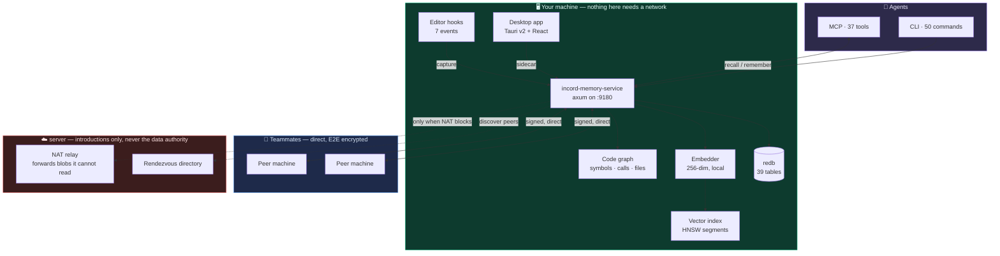
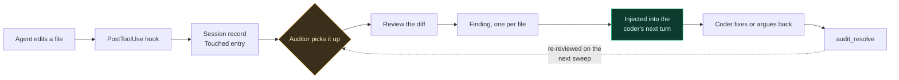
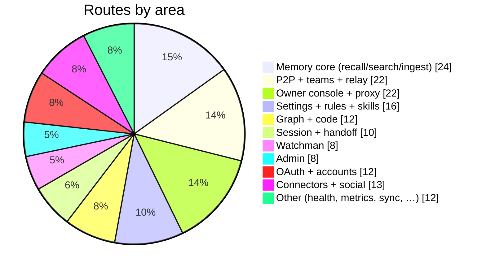
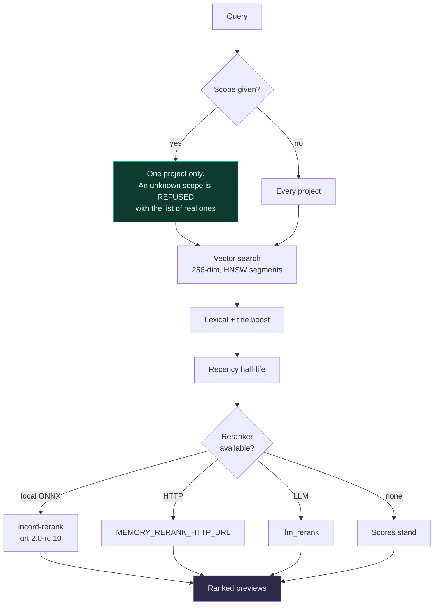
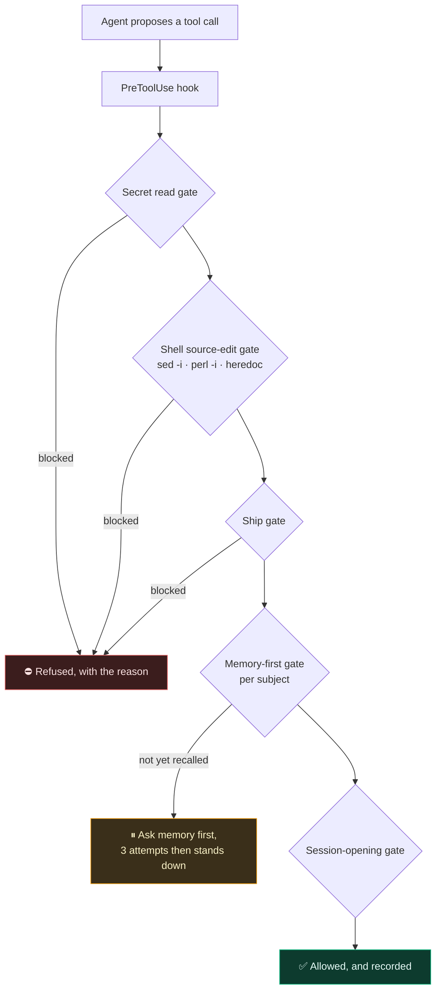
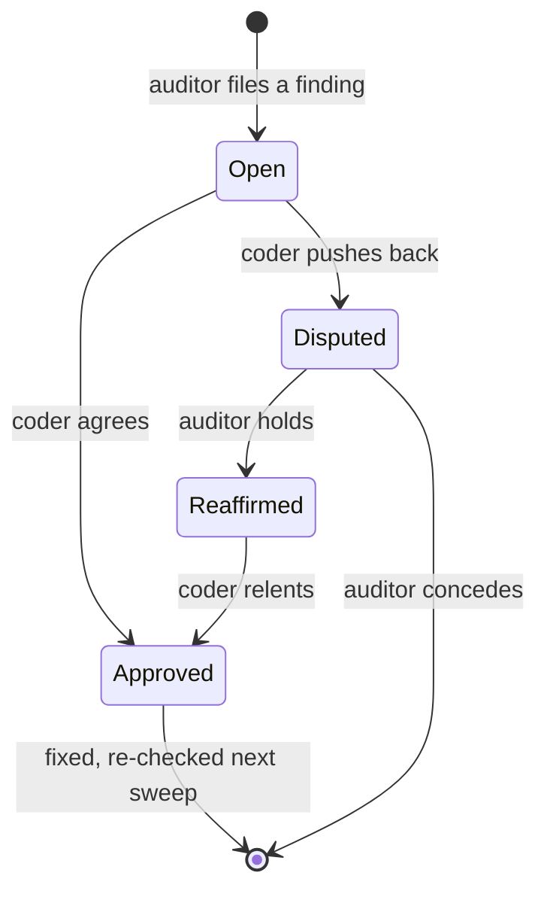

# Incord Memory

A local-first memory, governance and agent platform. Everything an AI coding agent
learns on your machine stays on your machine, syncs peer-to-peer to your teammates,
and is governed by rules the agent cannot talk its way past.

This is **the engine** — `incord-memory-service`.

> **How to read this file.** Every number, path and name below was read out of this
> repository, and each claim names the file it came from. Where a section describes
> something the code does *not* yet do, it says so. Comparisons against other
> products are the one exception — those are stated as of the date on each table and
> should be re-checked before you rely on them.
>
> **Paths** are relative to this crate — `src/…`, `crates/…`, `assets/…`.

---

## Contents

- [What this is](#what-this-is)
- [The tree](#the-tree)
- [Architecture](#architecture)
- [The engine](#the-engine)
- [Function inventory](#function-inventory)
- [The retrieval pipeline](#the-retrieval-pipeline)
- [Peer-to-peer team sync](#peer-to-peer-team-sync)
- [Governance: rules, guards and gates](#governance-rules-guards-and-gates)
- [The code auditor](#the-code-auditor)
- [The owner proxy](#the-owner-proxy)
- [Storage model](#storage-model)
- [Configuration](#configuration)
- [Comparison with the alternatives](#comparison-with-the-alternatives)
- [Build and run](#build-and-run)
- [Repository hygiene](#repository-hygiene)

---

## What this is

Most AI coding assistants forget everything when the window closes. The ones that
remember do it by sending your code and conversations to somebody else's server.

Incord takes the third path: a service that runs **on your machine**, captures every
session and code edit automatically through editor hooks, indexes it with a local
embedding model, and answers questions about your own history over MCP — with no
network hop in the data path. Teams share memory by talking **directly to each
other's machines**; the server exists only to introduce peers and to relay bytes it
cannot read.

Four things distinguish it from a vector database with a chat wrapper:

| | What it means |
|---|---|
| **Capture is automatic** | Editor hooks record every session and file edit. There is no "remember this" step to forget. |
| **Rules are enforced, not suggested** | A `PreToolUse` hook can **block** a tool call. Guards are code, not prompt text. |
| **The agent audits itself** | A background auditor reviews the files the coder just edited and files findings the coder must answer. |
| **A proxy holds your product beliefs** | It reviews decisions as you, and asks you only for what it genuinely cannot read. |

---

## The tree

```
incord-memory-service/
├── src/                     ← 79 modules, 111,104 lines
│   ├── api/                 ← 23 HTTP modules, 159 routes
│   ├── cli/                 ← hooks, guards, gates, install
│   ├── p2p/                 ← identity, middleware, peers, sync_loop, merge, relay
│   ├── store/               ← redb tables (findings, settings, sync)
│   ├── main.rs router.rs boot.rs wiring.rs
│   ├── mcp.rs               ← 37 MCP tools
│   ├── audit.rs             ← the code auditor
│   ├── proxy.rs proxy_prd.rs proxy_scan.rs   ← the owner proxy + belief
│   ├── search.rs score.rs scorer.rs embedder.rs vector_index.rs
│   ├── graph.rs code_chunk.rs tree.rs        ← code understanding
│   └── session_store.rs session_handoff.rs   ← capture
├── crates/
│   ├── incord-rag/          ← embed + rerank, multimodal entry points
│   ├── incord-rerank/       ← ONNX reranker (ort 2.0-rc.10)
│   └── incord-simd/
├── assets/owner/            ← owner.html, include_str!'d into the binary
├── docs/
├── deploy/
├── Cargo.toml
└── README.md                ← this file
```

---

## Architecture



**The red box is the point.** The cloud gateway is a phone book and a post box. It
never holds plaintext, never arbitrates conflicts, and the system keeps working when
it is unreachable.

### Where a memory comes from and where it goes



---

## The engine

Rust, axum 0.8, tokio, redb 2. **111,104 lines** across `src/`, in **79 modules**.

### Module map

| Area | Modules |
|---|---|
| **Capture** | `auto_capture`, `hooks`, `session_store`, `session_handoff`, `file_memory`, `extract` |
| **Retrieval** | `search`, `score`, `scorer`, `rerank_ext`, `llm_rerank`, `vector_index`, `embedder`, `think` |
| **Code understanding** | `code_chunk`, `code_sweep`, `graph`, `tree`, `data_chunk`, `file_history` |
| **Governance** | `cli/guard_rules`, `cli/guard_match`, `cli/guard_state`, `cli/ship_gate`, `cli/pre_tool_decide`, `redact` |
| **Audit** | `audit`, `store/findings_store` |
| **Proxy** | `proxy`, `proxy_prd`, `proxy_scan`, `owner_web`, `owner_sync`, `idle_watch` |
| **Sync / P2P** | `sync`, `sync_health`, `p2p/*` (identity, middleware, peers, broadcast, sync_loop, merge, peer_cache) |
| **Identity** | `auth`, `tenant_auth`, `oauth`, `oauth_api`, `space`, `projects`, `scope_backfill` |
| **Integration** | `mcp`, `connectors`, `integrations`, `social`, `tavily`, `discover`, `antigravity` |
| **Ops** | `jobs`, `worker_beat`, `task_cost`, `boot`, `wiring`, `router`, `store_migrate`, `rate_limit` |
| **Knowledge** | `facts`, `project_facts`, `skills`, `watchman`, `watchman_capture`, `watchman_api` |

### Feature flags — `Cargo.toml`

| Flag | Default | What it does |
|---|---|---|
| `owner_console` | ✅ on | Owner approval PWA, proxy, SSE |
| `owner_push` | ❌ off | VAPID Web Push. Pulls a C dependency (OpenSSL via `hyper-tls`), which is why it is separate. |
| `gpu` | ❌ off | GPU embedder. Costs ~75 s at model load to compile sequence-bucket kernels. |

> ⚠️ **`--features owner_push` is mandatory for any real deployment.** A plain
> `cargo build --release` compiles Web Push *out*, silently. The desktop sidecar
> builds with `owner_push,gpu` (`gpu-metal` on macOS).

---

## Function inventory

### MCP tools — 37

The interface agents actually use. From `src/mcp.rs`.

| Group | Tools |
|---|---|
| **Recall** (5) | `recall`, `recall_index`, `recall_get`, `recall_timeline`, `memory_search` |
| **Write** (3) | `remember`, `ingest_code`, `ingest_message` |
| **Correct** (3) | `edit_memory`, `forget_memory`, `forget_node` |
| **Reason** (1) | `think` — a synthesised, cited answer plus an explicit list of what is still unknown |
| **Code graph** (6) | `find_symbol`, `find_trajectory`, `file_history`, `trace_path`, `detect_changes`, `scope_index` |
| **User graph** (6) | `user_graph_search`, `user_graph_get_node`, `user_graph_put_node`, `user_graph_list_nodes`, `user_graph_path`, `user_graph_communities` |
| **Audit** (4) | `audit_findings`, `audit_get`, `audit_set`, `audit_resolve` |
| **Watchman** (3) | `watchman_lookup`, `watchman_handoff`, `watchman_report` |
| **Owner** (3) | `owner_ask`, `owner_post`, `owner_wait` |
| **Settings** (2) | `settings_get`, `settings_set` |
| **Meta** (1) | `incord` |

**The two-stage recall is the important one.** `recall_index` returns ranked
*previews*; `recall_get` fetches only the ones worth reading. A one-shot `recall`
exists but pulls everything — the two-stage flow is what keeps a wide search
affordable.

### HTTP API — 159 routes



<details>
<summary><b>Full route list by area</b></summary>

**Memory core**
`/v1/memory/search` · `/recall/index` · `/recall/get` · `/recall/timeline` ·
`/remember` · `/messages` · `/messages/batch` · `/ingest_message` · `/ingest_code` ·
`/ingest-projects` · `/conversations` · `/conversations/{id}` ·
`/conversations/{id}/messages` · `/embeddings` · `/think` · `/chat` · `/trajectory` ·
`/orient` · `/discover` · `/scopes` · `/restamp` · `/metrics` · `/usage` · `/health`

**Sessions and handoff**
`/session` · `/sessions` · `/session/entry` · `/session/entry/resolve` ·
`/session/catchup` · `/session/clear-check` · `/session/clear-request` ·
`/session/clear-confirm` · `/handoff` · `/files/conversations`

**Code and graph**
`/code/chunks` · `/code/sync` · `/graph/query` · `/graph/nodes` · `/graph/relate` ·
`/graph/path` · `/graph/export` · `/graph/communities` · `/graph/find-symbol` ·
`/graph/file-history` · `/project/facts/verified` · `/admin/code-sweep`

**Audit**
`/audit/findings` · `/audit/findings/{id}/apply` · `/audit/findings/{id}/dismiss` ·
`/audit/findings/clear`

**Owner console and proxy**
`/v1/owner/pending` · `/decide` · `/enqueue` · `/feed` · `/post` · `/comment` ·
`/history` · `/status` · `/meta` · `/key` · `/team` · `/peers` · `/channel` ·
`/clear` · `/proxy` · `/stream` · `/subscribe` · `/push/clear` · `/wait` ·
`/ask-memory` · `/owner.html` · `/owner-sw.js`

**P2P and teams**
`/p2p/bind` · `/p2p/unbind` · `/p2p/bindings` · `/p2p/bindings/{team}/key` ·
`/p2p/bindings/{team}/relay-key` · `/p2p/bindings/{team}/grants` ·
`/p2p/bindings/{team}/rotate` · `/p2p/browse` · `/p2p/teams/{team}/peers` ·
`/p2p/teams/{team}/versions` · `/p2p/teams/{team}/candidates` ·
`/p2p/teams/{team}/merges` · `/p2p/teams/{team}/merge/propose` ·
`/p2p/teams/{team}/merge/approve` · `/v1/teams/{id}/rendezvous` ·
`/rendezvous/announce` · `/relay/send` · `/relay/inbox` · `/relay/ack`

**Settings, rules, skills**
`/settings/audit` · `/settings/embed` · `/settings/handoff` · `/settings/jobs` ·
`/settings/llm` · `/settings/projects` · `/rules` · `/rules/for` · `/rules/manage` ·
`/skills` · `/skills/toggle` · `/enforcement` · `/agents` · `/agent-dirs` ·
`/companies` · `/companies/list`

**Watchman**
`/watchman/lookup` · `/watchman/handoff` · `/watchman/report` · `/watchman/recent` ·
`/watchman/tasks` · `/watchman/record/{id}` · `/watchman/for-memory/{msg_id}`

**Connectors, social, integrations**
`/connectors` · `/connectors/list` · `/connectors/{id}/test` · `/{id}/sync` ·
`/{id}/query` · `/{id}/delete` · `/social/providers` · `/social/{slug}/begin` ·
`/{slug}/callback` · `/{slug}/sync` · `/tavily/search` · `/drives` · `/llm/models`

**OAuth and accounts**
`/.well-known/oauth-authorization-server` · `/.well-known/oauth-protected-resource` ·
`/oauth/register` · `/oauth/authorize` · `/oauth/authorize/approve` · `/oauth/token` ·
`/link-account` · `/unlink-account` · `/secure`

**Admin**
`/admin/keys` · `/admin/keys/reset` · `/admin/keys/revoke` · `/admin/clear-titles` ·
`/admin/purge-analysis` · `/admin/refile-projects` · `/admin/refile-report` ·
`/admin/rewire-graph`

**Streaming**
`/v1/memory/stream` · `/notifications` · `/notifications/sse` · `/notifications/seen` ·
`/mcp` · `/mcp/sse` · `/tools` · `/tools/{name}`

**Sync**
`/sync` · `/sync/push` · `/sync/run` · `/sync-status`

</details>

### CLI — 50 commands

From the top-level command enum in `src/cli.rs`. (Extracted by pattern; a handful of
these are sub-enum variants rather than top-level commands, so treat 50 as the
upper bound.)

| Group | Commands |
|---|---|
| **Serve** | `serve`, `status`, `doctor`, `test`, `eval` |
| **Setup** | `install`, `install-hooks`, `setup`, `config`, `connect`, `login`, `link`, `unlink` |
| **Memory** | `remember`, `recall`, `search`, `think`, `forget`, `get`, `list`, `ingest-code`, `restamp`, `trajectory` |
| **Hooks** | `hook`, `capture`, `pre-tool`, `pre-compact`, `session-start`, `session-end`, `user-prompt`, `code-edit` |
| **Audit** | `audit`, `findings`, `sweep` |
| **Guards** | `guard`, `mode`, `ok` |
| **Owner** | `owner`, `ask`, `post`, `wait`, `proxy`, `clear` |
| **Projects** | `add`, `remove`, `add-folder`, `remove-folder`, `set`, `show` |
| **Sync** | `sync` |

### Editor hook events — 7

| Event | What Incord does |
|---|---|
| `SessionStart` | Injects rules, project memory, open audit findings, the session record |
| `UserPromptSubmit` | Injects the relevant memory for *this* prompt |
| `PreToolUse` | **Can block the call.** Guards, gates, rule enforcement |
| `PostToolUse` | Records the edit as a `Touched` entry — the only category a hook may write |
| `PreCompact` | Seals the session record before the window is summarised |
| `SessionEnd` | Writes the handoff |
| `Stop` | Captures the turn |

> `PostToolUse` writing only `Touched` is deliberate. Every other entry category is
> a *claim about meaning* — what is outstanding, what remains true — and only the
> agent doing the work can make one. A file edit is a mechanical fact the hook
> already observes, so it costs no model call and cannot be wrong about itself.

---

## The retrieval pipeline



**Scope is a boundary, not a preference.** A scoped search never widens into a
global one, so a scoped answer can never quietly contain another project's code. An
unknown scope is refused *with the list of known ones* rather than silently
returning nothing.

**Embeddings are 256-dimensional**, truncated from the model's native width and
re-normalised to unit length before storage (`src/embedder.rs:526`). Chunking uses
tree-sitter with grammars for **Rust, TypeScript, JavaScript and Python** only —
other languages fall back to plain text.

The `incord-rag` crate also carries multimodal entry points — `embed_image`,
`embed_video`, `embed_document`, `has_vision` — alongside `rerank`,
`rerank_with_instruct` and `rerank_batch`.

---

## Peer-to-peer team sync

A team is a pseudo-user `team:<id>` holding an **append-only log**. `/v1/memory/sync`
(GET) and `/sync/push` are idempotent on `client_msg_id`, so re-sends and overlapping
windows converge.

### Two paths, and why both exist


Broadcast is best-effort and pull is the guarantee: **cursor + idempotency means
nothing is ever missed, regardless of how long a node was offline.**

### What travels which way

| Payload | Path | Source |
|---|---|---|
| Team **code chunks** | Direct peer pull only (`sync_loop.rs` step 2, `pull_one`) | `code_share::publish` writes to the local team log; teammates pull |
| Owner-console decisions | Relay inbox / broadcast | `owner_sync.rs` |
| Merge proposals | Relay inbox / broadcast | `merge.rs` |

Code chunks are **content-addressed and deduplicated** — a verified test edited one
chunk of a file on a Mac and only that chunk moved to the PC; the file's other 11
chunks stayed put.

### The server's role, precisely

| Does | Does not |
|---|---|
| Directory — nodes register an address, look up their team roster | Hold plaintext |
| Membership gate — vouches which node-ids are on a team | Arbitrate conflicts |
| NAT relay — forwards E2E-encrypted blobs | Read what it forwards |

Identity is an **ed25519 keypair as node-id** (`src/p2p/identity.rs`), with
signed-HTTP envelope verification, ±30 s freshness and a replay guard
(`src/p2p/middleware.rs`).

> **Design history worth keeping.** The P2P layer was adapted from `brain`'s
> `incord-network` crate, deliberately trimmed. Dropped: the routing HashRing,
> fetcher/consumer, witness, quorum, directive/governance, `chain.rs` and payouts.
> Blockchain, staking, witness and quorum were **explicitly rejected** for memory —
> they belonged to `brain`, not here. Gossip was not copied either: `brain` uses
> static seed peers, memory uses server rendezvous.

---

## Governance: rules, guards and gates

This is the part with no equivalent in the tools Incord is usually compared to.



### The gates, by name

| Gate | File | What it stops |
|---|---|---|
| `secret_read_gate` | `src/cli/guard_match.rs` | Reading credential files |
| `shell_source_edit_gate` | `src/cli/guard_match.rs` | In-place source rewrites through the shell (`sed -i`, `perl -i`, heredocs) where no gate can see them |
| Ship gate | `src/cli/ship_gate.rs` | Publishing without the checks |
| Memory-first gate | `src/cli/guard_rules.rs` | Acting on a subject before querying memory about it |
| Session-opening gate | `src/cli/guard_rules.rs` | Starting work without reading the previous session's handoff |

**Every gate stands down after 3 attempts**, and each has an off switch
(`MEMORY_FIRST_OFF`, `SESSION_OPENING_OFF` in a project's `.incord/`, or
`~/.incord/RULE_GATE_OFF` globally). A memory service that is down can never wedge a
session — that is a deliberate property, not an accident.

Rule text is injected at `SessionStart` and again on `UserPromptSubmit`, so a rule
cannot fall out of a long context.

---

## The code auditor

A second model reviews what the coder just wrote, and the coder must answer.

**It reviews what was edited, not what the folder contains.** Selection reads the
`Touched` entries the `PostToolUse` hook already wrote
(`src/cli/capture_session.rs:217`) — so the edit list costs no model call and no
directory walk. A file that arrives any other way — a pull, a merge, another tool —
is deliberately *not* a candidate. This is an audit of the coder's work, not a
repository scanner.



**One finding per file, not per line.** The finding's identity is the file
(`Finding::make_id(path, "")`); the worst severity wins and every issue found in that
file becomes a round of the same conversation. The earlier per-line identity produced
6,179 findings across 141 files on one install — 37 MB, and 20.1 s to list the open
ones.

A claim of "fixed" is **not trusted**: the auditor re-reviews any file whose mtime is
newer than the finding, so a fix that did not hold comes straight back.

---

## The owner proxy

The proxy acts *as you* on decisions. To do that it holds a **belief** about each
project, and the belief is built in parts.

| Part | What it is |
|---|---|
| `about` | What the project is, and what it is *not* |
| `goals` | What success looks like, what comes next, what must never be approved |
| `prd` | The product document every decision is judged against |

**Each part is saved on its own.** A draft that answers one part fills that part and
keeps the rest; an empty field never overwrites a stored one. You can answer `about`
today and `goals` next week.

**Documents are read once.** Each scanned file carries a stable `id` (SHA-256 of its
project-relative path) and a `stamp` (a digest of the text actually read), kept in
`ProjectBrief.doc_reads`. A document whose stamp matches is **named but not
re-sent** — the drafter is told it is part of the belief already held, so its absence
can never be read as the project lacking it.

> The stamp is a content digest rather than size+mtime. Size+mtime was tried first
> and was measurably wrong on this hardware: two fixture files written in one
> operation came back with byte-identical stamps, because the filesystem's mtime
> granularity is coarser than the writes. The scan has already read the file, so
> hashing costs no extra IO — and what this saves is tokens, not the local read.

The rate limit is a single rule with no timer: **an unanswered question stops the
asking, and an answer restarts it.** Silence is self-terminating in both directions.

---

## Storage model

**redb**, embedded, single file. 41 tables.

| Group | Tables |
|---|---|
| **Messages** | `messages`, `conversations`, `conv_tombstones`, `msg_authors`, `client_idempotency`, `title_pending` |
| **Vector index** | `vindex_keys`, `vindex_meta`, `vindex_dirty`, `embed_pending` |
| **Graph** | `graph_nodes`, `graph_edges_in`, `graph_edges_out`, `graph_idx_symbol`, `graph_idx_symbol_by_file`, `graph_idx_call_by_caller`, `graph_idx_call_by_callee`, `graph_idx_call_by_file`, `graph_idx_user_day`, `graph_idx_user_kind_date` |
| **Sessions** | `sessions`, `sessions_by_project`, `inflight`, `clear_requests` |
| **Audit** | `findings` |
| **Watchman** | `watchman_records`, `watchman_by_task`, `watchman_by_memory`, `watchman_task_meta` |
| **Sync** | `sync_state`, `sync_seen`, `owner_feed_seen` |
| **Identity** | `tenant_keys`, `oauth_clients`, `oauth_codes`, `oauth_access`, `oauth_refresh` |
| **Config** | `settings`, `companies`, `connectors`, `project_facts` |

**Index keys carry their own ordering.** `sessions_by_project` stores
`tenant\0user\0project\0<u64::MAX - touched>\0session_id`, so ascending byte order is
newest-first and a reader stops after `limit` rows instead of walking a project's
whole history.

> A trap worth knowing: because the index groups by *project*, reading its rows in
> raw order returns whichever project sorts first **by name** and calls it recent.
> Cross-project "what did I touch lately" must sort explicitly —
> `SessionStore::recent_for_user` does, and scans keys before deserialising records.

---

## Configuration

**7 settings structs**, each with an HTTP endpoint and a screen in the app:
`AuditSettings`, `EmbedSettings`, `HandoffSettings`, `JobsSettings`, `OwnerSettings`,
`ProjectsSettings`, `SkillsSettings`.

**~100 environment variables.** The ones that matter most:

| Variable | Controls |
|---|---|
| `MEMORY_DB_PATH` · `INCORD_HOME` · `MEMORY_LOG_PATH` | Where state lives |
| `MEMORY_BIND` · `MEMORY_PUBLIC_URL` · `MEMORY_ALLOWED_ORIGINS` | Network surface |
| `MEMORY_EMBED_MODE` · `MEMORY_MODEL_DIR` · `MEMORY_MODEL_ID` · `MEMORY_EMBED_THREADS` | Embedding |
| `MEMORY_RERANK` · `MEMORY_RERANKER` · `MEMORY_RERANK_HTTP_URL` · `MEMORY_RERANK_TOPN` | Reranking |
| `MEMORY_ANN_THRESHOLD` · `MEMORY_ANN_SEGMENT_MAX` · `MEMORY_ANN_MAX_PER_USER` | Vector index |
| `MEMORY_RECENCY_HALFLIFE_DAYS` · `MEMORY_TITLE_BOOST` · `MEMORY_FLOOR_RATIO` · `MEMORY_VECTOR_DIRECT_WEIGHT` | Ranking |
| `MEMORY_SYNC_AUTO` · `MEMORY_SYNC_REMOTE_URL` · `MEMORY_SYNC_INTERVAL_SECS` | Sync |
| `MEMORY_AUTO_CAPTURE` · `MEMORY_CODE_SWEEP` · `MEMORY_FILE_MEMORY` · `MEMORY_WATCHMAN` | Background work |
| `MEMORY_REDACT_SECRETS` · `INCORD_BLOCKED_NAMES` · `MEMORY_RATE_LIMIT_RPM` | Safety |
| `MEMORY_LLM_PROVIDER` · `MEMORY_LLM_URL` · `MEMORY_THINK_MODEL` | LLM routing |
| `MEMORY_ADMIN_TOKEN` · `MEMORY_ALLOW_REMOTE_KEYLESS` | Admin auth |

---

## Comparison with the alternatives

> Competitor rows describe the shipping products as of **September 2026** and are the
> only claims here not read from this repository. Verify before relying on them.

### Where the data lives — the axis that decides everything else


### Feature matrix

| | **Incord** | Mem0 | Zep | Letta | Claude native | Cursor rules |
|---|---|---|---|---|---|---|
| Runs fully offline | ✅ | ⚠️ self-host | ❌ | ⚠️ self-host | ❌ | ✅ |
| Data never leaves the machine | ✅ | ⚠️ | ❌ | ⚠️ | ❌ | ✅ |
| **Automatic capture** (no "remember this") | ✅ hooks | ❌ | ❌ | ❌ | ⚠️ partial | ❌ |
| MCP tools | ✅ 37 | ⚠️ | ⚠️ | ⚠️ | n/a | ❌ |
| **Can block a tool call** | ✅ | ❌ | ❌ | ❌ | ❌ | ❌ |
| **Self-auditing code review** | ✅ | ❌ | ❌ | ❌ | ❌ | ❌ |
| Code graph (symbols · calls) | ✅ | ❌ | ❌ | ❌ | ❌ | ❌ |
| **P2P team sync, no cloud data path** | ✅ | ❌ | ❌ | ❌ | ❌ | ❌ |
| Works with the cloud down | ✅ | ❌ | ❌ | ⚠️ | ❌ | ✅ |
| Temporal knowledge graph | ✅ | ⚠️ | ✅ | ⚠️ | ❌ | ❌ |
| Multimodal embedding | ✅ img/video/doc | ❌ | ❌ | ❌ | n/a | ❌ |
| Desktop app | ✅ Tauri | ❌ | ❌ | ⚠️ | ✅ | ✅ |
| Per-project rule enforcement | ✅ | ❌ | ❌ | ❌ | ⚠️ | ⚠️ advisory |
| Marginal cost per recall | **£0** local | per call | per call | per call | per call | £0 |
| Setup effort | 🔴 high | 🟢 low | 🟢 low | 🟡 medium | 🟢 none | 🟢 low |
| Ecosystem maturity | 🔴 young | 🟡 | 🟡 | 🟡 | 🟢 | 🟢 |

**Read the last two rows honestly.** Incord asks more of you up front and has a far
smaller ecosystem than any hosted alternative. What it buys is the four ✅s nothing
else in the table has: enforcement, self-audit, a code graph, and a team sync with no
cloud in the data path.

### Storage engine — why redb

| | **redb** ✅ | SQLite | RocksDB | LMDB | Postgres + pgvector |
|---|---|---|---|---|---|
| Pure Rust, no C toolchain | ✅ | ❌ | ❌ | ❌ | ❌ |
| Zero-copy reads | ✅ | ❌ | ❌ | ✅ | ❌ |
| MVCC, no reader locks | ✅ | ⚠️ WAL | ✅ | ✅ | ✅ |
| Single-file, embeddable | ✅ | ✅ | ❌ dir | ✅ | ❌ server |
| Ordered-key range scans | ✅ | ⚠️ index | ✅ | ✅ | ⚠️ index |
| Cross-compiles cleanly | ✅ | ⚠️ | ❌ | ⚠️ | n/a |

The ordered-key property is load-bearing, not incidental: the by-project session
index, the findings scan and the watchman lookup are all prefix range scans that
`break` on the first non-matching key. A hash store would need a full iteration for
each.

### Embedding — 256 dimensions

| Width | Bytes/vector | 1M vectors | Recall vs. 768d |
|---|---|---|---|
| 1536 (OpenAI large) | 6,144 | 6.1 GB | +2–4 % |
| 768 (base) | 3,072 | 3.1 GB | baseline |
| **256 (Incord)** ✅ | **1,024** | **1.0 GB** | **−1–3 %** |
| 128 | 512 | 0.5 GB | −8–12 % |

256 is the knee: **⅓ the storage of 768** for a small recall cost, and it keeps a
million-vector index inside a laptop's page cache. Vectors are truncated from the
model's native width and re-normalised to unit length.

### Chunking — tree-sitter vs. the alternatives

| Approach | Respects syntax | Cost | Incord |
|---|---|---|---|
| Fixed-size windows | ❌ splits functions | 🟢 trivial | fallback |
| Recursive character split | ⚠️ approximate | 🟢 cheap | ❌ |
| **tree-sitter AST** | ✅ exact | 🟡 grammar per language | ✅ **Rust · TS · JS · Python** |
| LLM-segmented | ✅ | 🔴 a model call per file | ❌ |

**Honest limit:** four grammars. A Go, Java, C++ or Ruby file falls back to plain
text and loses symbol-level structure. Adding a language is adding a grammar
dependency and a mapping — not a rewrite.

---

## Build and run

### The engine — from this directory

```bash
cargo build --release --features owner_push     # owner_push is NOT optional
cargo test  --features owner_push               # 1,074 tests
./target/release/incord-memory-service serve
```

> Startup takes roughly **2.5 minutes** — the embedding model loads first. A short
> timeout will look like a crash when nothing is wrong.

### Shipped as a desktop sidecar

The desktop app bundles this binary as an `externalBin` sidecar and builds it with
`--features owner_push,gpu`. The staging step fingerprints this crate's source and
skips the rebuild when nothing changed; `FORCE_SIDECAR_BUILD=1` overrides that.

The owner console (`assets/owner/owner.html`) is `include_str!`-embedded in this
binary (`src/api/owner_feed.rs:650`), so it ships with the **engine** — a deploy
that updates only a gateway does not update the console.

---

## Hygiene

Two things in this crate are known artifact pollution and should be cleaned up:

1. **`src/**/*.audit.bak.*`** — ~40 backup copies of source files sitting inside
   `src/`, produced by the mandatory-backup rule. They are inside the compiled
   crate's directory and they turn up in every `grep`.
2. **`src/.backups/`** — same cause, same problem.

Neither affects the build; both make the tree harder to read and searches noisier.
Writing backups to a directory *outside* the crate would fix both without
weakening the rule that creates them.

---

## Project status

| Area | State |
|---|---|
| Memory capture, recall, MCP | ✅ shipping |
| Code graph + chunking | ✅ shipping (4 languages) |
| Guards, rules, gates | ✅ shipping |
| Code auditor | ✅ shipping — per-file findings |
| Owner proxy + belief | ✅ shipping — parts save independently |
| P2P team sync | ✅ shipping — direct pull + relay fallback |
| Belief hold | ✅ releases as soon as the CLI answers again |
| WebSocket owner surface | 🚧 planned |

**Test suite: 1,076 passing.**
